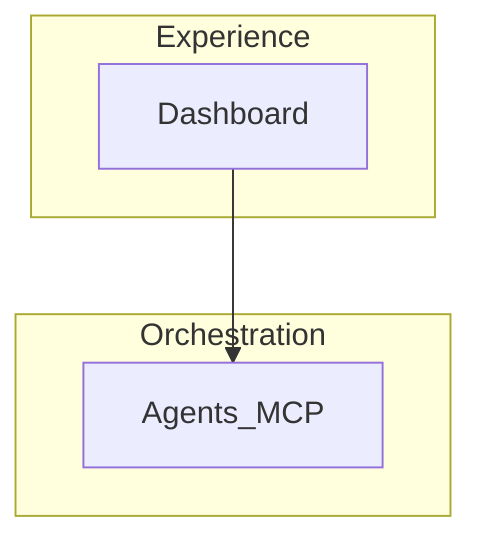

# README template skeleton

Copy and replace `{{PLACEHOLDERS}}`.

```markdown
<div align="center">

# 🧠 {{PROJECT_NAME}}

### *{{TAGLINE_ITALIC}}*

**{{SUBTITLE_MIDDLE_DOT}}**

<br />

[]({{EVENT_URL}})
[]({{TRACK_URL}})
[](SUBMISSION.md)

<br />

[]({{LIVE_URL}})
[]({{DOC_HUB_URL}})
[](JUDGE_GUIDE.md)
[]({{GITHUB_URL}})

<br />

[](https://www.typescriptlang.org/)
[](https://nodejs.org/)
[](LICENSE)

<br />

> **New here?** {{ONE_LINE_POINTER}}

<br />

```
{{ASCII_FLOW_BOX}}
```

</div>

---

## 📑 Contents

| | |
|:---|:---|
| ⚖️ | [For judges](#-for-judges--5-min-verify) |
| 🏗️ | [Overview](#-overview) |
| ⚡ | [Quick start](#-quick-start) |
| 📚 | [Documentation](#-documentation) |

---

<div align="center">

## ⚖️ For judges — 5 min verify

**{{NO_SECRETS_LINE}}**

</div>

```bash
{{VERIFY_COMMANDS}}
```

| 🔗 Resource | 📍 Link |
|:------------|:--------|
| **📚 Doc hub** | {{DOC_HUB_LINKS}} |
| **⚖️ Runbook** | [JUDGE_GUIDE.md](JUDGE_GUIDE.md) |

<details>
<summary><strong>📖 Open locally (Windows / macOS)</strong></summary>

| Platform | Command |
|:---------|:--------|
| **🌐 Live** | {{LIVE_DOC_HUB_URL}} |
| **🪟 Windows** | `start docs\doc-map.html` |
| **🍎 macOS** | `open docs/doc-map.html` |

</details>

---

## 🏗️ Overview

{{ONE_PARAGRAPH_VALUE_PROP}}

| Layer | Responsibility |
|:------|:---------------|
| **🖥️ Experience** | … |
| **🤖 Orchestration** | … |
| **💾 Hybrid memory** | … |
| **⛓️ Chain + storage** | … |



---

## ⚡ Quick start

```bash
{{DEV_COMMANDS}}
```

---

## 📚 Documentation

| 📄 Document | 🎯 Purpose |
|:------------|:-----------|
| [JUDGE_GUIDE.md](JUDGE_GUIDE.md) | Runbook |
| [docs/ARCHITECTURE.md](docs/ARCHITECTURE.md) | Architecture |

---

<details>
<summary><strong>🔗 References</strong></summary>

| Resource | URL |
|:---------|:----|
| … | … |

</details>

---

<div align="center">

**{{PROJECT_NAME}}**

*{{TAGLINE_ITALIC}}*

[](https://github.com/{{ORG}}/{{REPO}}/stargazers)

</div>
```
