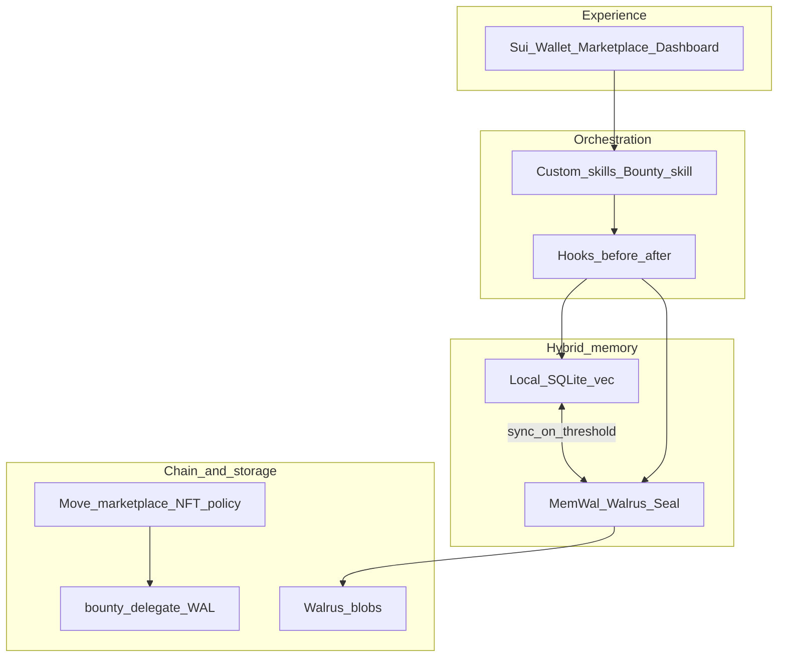

# MemWal++

**A verifiable memory economy for autonomous agents** — built for **[Sui Overflow 2026](https://overflow.sui.io)** (**Walrus track** · [problem statement](https://mystenlabs.notion.site/walrus-track-problem-statement)).

## Contents

- [Overview](#overview)
- [Repository layout](#monorepo-layout)
- [Architecture](#architecture-at-a-glance)
- [Build order (recommended)](#build-order-recommended)
- [Quick start](#quick-start)
- [On-chain package](#published-move-package-sui-mainnet)
- [Documentation index](#documentation)
- [Checklists](#walrus-track-checklist)

---

## Overview

MemWal++ combines **Walrus + [MemWal](https://docs.memwal.ai)** (durable, encrypted, verifiable recall) with **Sui Move** (MemoryPack-style NFTs, marketplace, bounties, royalties, delegate bridge) and **NemoClaw / OpenClaw** orchestration (hooks, skills, bounty agents). A **hybrid memory plane** keeps work **local-first** (fast recall, quality gates, PII redaction) and syncs upward only when memories meet policy — then **Walrus** holds the cryptographic truth judges can verify.

**Canonical architecture (merged, final):** [`docs/diagrams/memwalpp-merged-architecture.svg`](docs/diagrams/memwalpp-merged-architecture.svg)

**Full system write-up:** [`docs/ARCHITECTURE.md`](docs/ARCHITECTURE.md)

Supplementary notes (original brief, mixed language): [`docs/SOURCE-memwalpp.md`](docs/SOURCE-memwalpp.md).

Cursor rules (always-on): [`.cursor/rules/memory-marketplace-rules.mdc`](.cursor/rules/memory-marketplace-rules.mdc) · Karpathy guidelines: [`.cursor/rules/karpathy-guidelines.mdc`](.cursor/rules/karpathy-guidelines.mdc)

---

## Architecture at a glance

The merged diagram defines **four vertical layers** (top to bottom):

| Layer | Responsibility |
|-------|----------------|
| **Experience** | Sui wallet, marketplace UI, dashboard — what users, developers, and judges touch. |
| **Orchestration** | **NemoClaw / OpenClaw** — sandboxed agent swarm, **MemWal plugin** (`oc-memwal`), **custom skills** (browse, bid, evaluate, integrate), **before/after hooks** (auto-capture, quality score, PII redaction, sync trigger), **bounty skill** (post, browse, bid, fulfill, claim WAL). |
| **Hybrid memory** | **Local:** SQLite + vectors, [agentmemory](https://github.com/rohitg00/agentmemory)-style curation, sub-5 ms recall, offline cache. **Durable:** MemWal SDK, **Seal**, PoA, namespaces, lineage — **bidirectional sync** when quality thresholds pass. |
| **Sui + Walrus** | **Move:** `memory_nft`, `marketplace`, `access_policy`, **Kiosk + royalties**, **WAL** settlement, **delegate bridge**; **bounty** module (escrow, on-chain requirements). **Walrus:** encrypted blobs, erasure coding, PoA, Seal key gating — persistence under MemWal. |



Project principles for Cursor agents live under **`.cursor/rules/`** — use **`memory-marketplace-rules.mdc`** as the primary always-on rule file.

---

## Demo data flow (judge narrative)

1. **Agent turn** — OpenClaw hooks — **local scoring** (agentmemory + memoirs-style adapters) — if quality passes — **push encrypted blob** via MemWal onto **Walrus**.
2. **Marketplace listing** — **Sui object** (MemoryPack / NFT-like) + **metadata on Walrus**.
3. **Bounty-hunter agent** — scan **on-chain bounties** — evaluate locally — acquire memory — integrate — improve — **fork** new version (**royalty** to original creator).
4. **Verification** — **cryptographic proof on Walrus** + **performance metrics** tied to on-chain events (see ADR-005 in `docs/decisions/`).

---

## Technology stack

| Layer | Technology | Role |
|-------|------------|------|
| Orchestration | [NVIDIA NemoClaw](https://github.com/NVIDIA/NemoClaw) + OpenClaw | Secure sandbox, swarm, policy, MemWal plugin |
| Durable memory | [MystenLabs / MemWal](https://github.com/MystenLabs/MemWal) + Walrus | Verifiable, shareable, encrypted agent memory |
| Local cache and scoring | [agentmemory](https://github.com/rohitg00/agentmemory), [memoirs](https://github.com/misaelzapata/memoirs) (adapters in-repo) | Quality gate, fast recall, PII redaction before sync |
| On-chain economy | Move in `packages/sui-contracts` | Bounty, royalty, MemoryPack NFT, marketplace, delegate bridge, access policy |
| Frontend | Next.js + `@mysten/dapp-kit` | Marketplace, Memory Kiosk, wallet |

Move listing patterns draw from community curriculum (e.g. [sui-move-intro-course](https://github.com/sui-foundation/sui-move-intro-course)) — extended here for **memory, bounty, and royalty** flows.

---

## Monorepo layout

```
memwalpp/
├── apps/dashboard/       # Next.js + dApp Kit
├── apps/agent-swarm/     # NemoClaw / OpenClaw runner
├── apps/cli/             # Optional PTB helpers
├── packages/core/
├── packages/local-memory/
├── packages/memwal-client/
├── packages/shared/      # Cross-cutting types (no I/O) — foundation package
├── packages/sui-contracts/
├── packages/ui/
├── contracts/            # Pointer to Move package
├── docs/                 # ARCHITECTURE.md, ADRs, specs, diagrams
├── openspec/
├── scripts/
└── .cursor/rules/        # memory-marketplace-rules.mdc, karpathy-guidelines.mdc
```

### Current structure (confirmed)

| Area | Status | Notes |
|------|--------|------|
| **Turborepo + pnpm** | Active | `turbo.json`, `pnpm-workspace.yaml`, root `package.json` |
| **Move contracts** | Published on mainnet | See package ID below; sources under `packages/sui-contracts` |
| **`@memwalpp/shared`** | Types expanded | `ObjectId`, `MemoryRecord`, `Bounty`, `AgentAction`, indexer rows — see `packages/shared/src/` |
| **Dashboard** | Scaffold | Next 15 + dApp Kit; wire env package ID |
| **MemWal client** | Stubs + interfaces | Replace with `@memwal/sdk` + relayer (ADR-001) |
| **Local memory** | Stubs | Adapters for agentmemory / memoirs patterns |
| **Indexer** | Schema only | `docs/specs/indexer-schema.sql` — wire a worker next |
| **OpenSpec / skills** | Present | `openspec/`, `.cursor/skills/`, `skills-lock.json` |

---

## Build order (recommended)

1. **`@memwalpp/shared`** — types and pure helpers (no dependencies). *Done as foundation.*
2. **`@memwalpp/ui`** — presentational components (depends on shared only where needed).
3. **`@memwalpp/memwal-client`** — MemWal + Walrus wrapper, hooks, `IMemWalAgent` (depends on shared).
4. **`@memwalpp/local-memory`** — SQLite + scoring adapters (depends on shared).
5. **`@memwalpp/core`** — marketplace / bounty / memory domain services (depends on client + shared).
6. **`packages/sui-contracts`** — `pnpm contracts:build` / `contracts:test` (Sui CLI).
7. **`apps/dashboard`** — Next build after upstream packages `check` clean.
8. **`apps/agent-swarm`** — runner + skills once client/core APIs stabilize.
9. **Indexer service** — consume Move events → Postgres → Kiosk API.
10. **E2E demo script** — `pnpm demo` proves Walrus + Sui + agent path for judges.

Within Turborepo, `build` / `check` chains follow **`^build` / `^check`** so upstream packages run first.

---

## Published Move package (Sui Mainnet)

| Field | Value |
|-------|--------|
| **Package ID** | `0x48db008a3c9e638dd17d20702632d9909c3c075e44eb339f890fb29503ec3050` |
| **Suiscan** | [Package on mainnet](https://suiscan.xyz/mainnet/object/0x48db008a3c9e638dd17d20702632d9909c3c075e44eb339f890fb29503ec3050) |
| **Modules** | `wal`, `memory_nft`, `marketplace`, `royalty`, `bounty`, `delegate_bridge`, `access_policy` |

**WAL note:** this deployment defines a **`WAL` coin type minted by the package** for demo economics. It is not automatically interchangeable with any other asset that shares the ticker — use an explicit bridge or wrap if you need a different coin type.

---

## Quick start

**Requirements:** Node.js 20+, pnpm 10, [Sui CLI](https://docs.sui.io/guides/developer/getting-started/sui-install)

```bash
pnpm install
pnpm contracts:build
pnpm contracts:test
pnpm build
pnpm --filter dashboard dev
```

Copy [`.env.example`](.env.example) to `.env.local` and set `NEXT_PUBLIC_MARKETPLACE_PACKAGE_ID` to the package ID above.

**Indexer:** [`docs/specs/indexer-schema.sql`](docs/specs/indexer-schema.sql)

---

## Scripts

| Command | Purpose |
|---------|---------|
| `pnpm contracts:build` | `sui move build` |
| `pnpm contracts:test` | `sui move test` |
| `pnpm build` | Turborepo build |
| `pnpm check` | Typecheck / lint |
| `pnpm demo` | `scripts/demo-runner.ts` |

---

## Documentation

| Path | Content |
|------|---------|
| [`PROJECT.md`](PROJECT.md) | Vision, goals, non-goals |
| [`ROADMAP.md`](ROADMAP.md) | Phased milestones + exit criteria |
| [`docs/ARCHITECTURE.md`](docs/ARCHITECTURE.md) | **Canonical** layered architecture + flows + repo map |
| [`docs/decisions/`](docs/decisions/) | ADR-001 through **ADR-013** (monorepo boundaries) |
| [`docs/GIT-AND-VERSIONING.md`](docs/GIT-AND-VERSIONING.md) | Branch + tag + version policy |
| [`docs/CLAUDE.md`](docs/CLAUDE.md) | Commands and guardrails for AI assistants |
| [`docs/diagrams/memwalpp-merged-architecture.svg`](docs/diagrams/memwalpp-merged-architecture.svg) | Merged architecture diagram |
| [`docs/SOURCE-memwalpp.md`](docs/SOURCE-memwalpp.md) | Original planning notes |
| [`docs/specs/indexer-schema.sql`](docs/specs/indexer-schema.sql) | Kiosk / marketplace indexer DDL |
| [`.cursor/rules/memory-marketplace-rules.mdc`](.cursor/rules/memory-marketplace-rules.mdc) | Primary Cursor project rules |
| [`openspec/README.md`](openspec/README.md) | Pointer: specs live under `docs/specs/` until split |

---

## Walrus track checklist

- Walrus and MemWal on the **critical demo path** (blobs, PoA, recall).
- Sui contracts and events **visible** in explorer and/or indexer-driven UI.
- Agent story shows **integration**, not unused imports.
- **AI-assisted development** disclosed per hackathon rules and ADR-012.

---

## Security

Use **MemWal delegate keys** only. Never commit owner keys. Keep secrets in local env or CI vaults.

---

## License

Add SPDX license (MIT or Apache-2.0, etc.) before public release.

---

## Acknowledgements

Mysten Labs (Sui, Walrus, MemWal, Seal), Sui Overflow, and the open-source projects referenced above.

---

<p align="center"><strong>MemWal++</strong> — Portable, verifiable memory for autonomous agents on Sui and Walrus</p>
