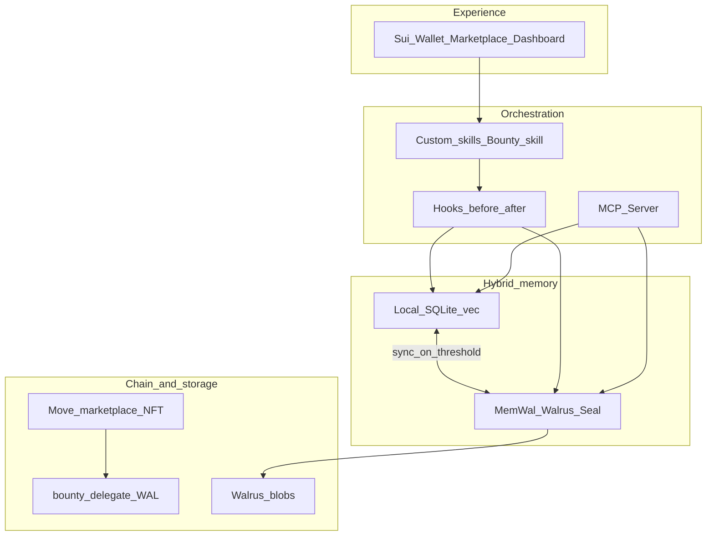

<div align="center">

# 🧠 MemWal Agent Memory

### *Hybrid verifiable memory for autonomous agents*

**Local speed · Walrus truth · On-chain economy**

<br />

[](https://overflow.sui.io)
[](https://mystenlabs.notion.site/walrus-track-problem-statement)
[](https://overflow.sui.io)
[](SUBMISSION.md)

<br />

[](https://memwalpp-dashboard.vercel.app/)
[](https://memwalpp-dashboard.vercel.app/doc-hub/)
[](JUDGE_GUIDE.md)
[](https://github.com/Olympusxvn/memwal-agent-memory)

<br />

[](https://www.typescriptlang.org/)
[](https://nodejs.org/)
[](https://pnpm.io/)
[](https://sui.io/)
[](https://docs.wal.app/)
[](packages/mcp/README.md)
[](LICENSE)

<br />

> **New here?** Start with **[SUMMARY.md](SUMMARY.md)** — role, benefits, and judge path in one page.  
> Built on official **[Walrus Memory (MemWal)](https://docs.wal.app)** · wraps `@mysten-incubation/memwal`, does **not** fork it.

<br />

```
┌─────────────────────────────────────────────────────────────────────┐
│  🏠 Local-first  ──►  🛡️ Redact + Gate  ──►  🐋 Walrus blob       │
│                              │                                      │
│                              ▼                                      │
│                    ⛓️ Sui Move · Marketplace · Bounties             │
└─────────────────────────────────────────────────────────────────────┘
```

</div>

---

## 📑 Contents

| | |
|:---|:---|
| ⚖️ | [For judges — 5 min verify](#-for-judges--5-min-verify) |
| 🎬 | [Demo slides & Doc Hub](#-demo-slides--doc-hub) |
| 🔌 | [MCP Server `@memwalpp/mcp`](#-mcp-server--memwalppmcp) |
| 🚀 | [Companion MVP — Mr. Toxic Special One](#-companion-mvp--mr-toxic-special-one) |
| 🛠️ | [Product — Cursor & Claude](#-product--cursor--claude) |
| 🏗️ | [Overview & architecture](#-overview) |
| ⚡ | [Quick start](#-quick-start) |
| ⛓️ | [Move contracts (mainnet)](#-move-contracts-sui-mainnet) |
| 📚 | [Documentation](#-documentation) |
| 🔗 | [References](#-references) |

---

<div align="center">

## ⚖️ For judges — 5 min verify

**No wallet · No MemWal keys · No Sui CLI · Exit `0` on every step**

</div>

```bash
git clone https://github.com/Olympusxvn/memwal-agent-memory.git
cd memwal-agent-memory
pnpm install && pnpm mcp:build && pnpm mcp:e2e && pnpm agent:demo && pnpm agent:bounty-hunt
```

| 🔗 Resource | 📍 Link |
|:------------|:--------|
| **📚 Documentation hub** | Live → [memwalpp-dashboard.vercel.app/doc-hub](https://memwalpp-dashboard.vercel.app/doc-hub/) · Repo → [docs/doc-map.html](docs/doc-map.html) |
| **🌐 Live dashboard** | [memwalpp-dashboard.vercel.app](https://memwalpp-dashboard.vercel.app/) |
| **📄 Summary (live)** | [memwalpp-dashboard.vercel.app/summary](https://memwalpp-dashboard.vercel.app/summary) |
| **⚖️ Runbook** | [JUDGE_GUIDE.md](JUDGE_GUIDE.md) |
| **🎓 Workshop → repo** | [docs/judge-walrus-memory-workshop.md](docs/judge-walrus-memory-workshop.md) |
| **📋 Submission brief** | [SUBMISSION.md](SUBMISSION.md) |
| **🐋 Walrus code path** | `packages/core/src/memory/memory-sync-service.ts` |

<details>
<summary><strong>📖 Open Doc Hub locally (Windows / macOS)</strong></summary>

| Platform | Command |
|:---------|:--------|
| **🌐 Live (recommended)** | [https://memwalpp-dashboard.vercel.app/doc-hub/](https://memwalpp-dashboard.vercel.app/doc-hub/) |
| **🪟 Windows** | `start docs\doc-map.html` |
| **🍎 macOS** | `open docs/doc-map.html` |

</details>

> ✨ Built on the official [Walrus Memory Workshop](https://mystenlabs.notion.site/Walrus-Memory-Workshop-Build-on-the-Memory-Layer-3666d9dcb4e9801dadb0e67ad368235e).  
> You do **not** need the [workshop kit](https://github.com/DionisisLougaris/walrus-memory-workshop-kit) to score us.  
> Expect colored `[1/N]` steps and `── RESULT ── PASS`. Optional live Walrus: [.env.example](.env.example) + `MEMWAL_AUTO_PUSH=1`.

---

<div align="center">

## 🎬 Demo slides & Doc Hub

</div>

| | |
|:--|:--|
| **🎞️ Demo deck (HTML)** | Live → [memwalpp-dashboard.vercel.app/memwalpp-slides.html](https://memwalpp-dashboard.vercel.app/memwalpp-slides.html) · Repo → [docs/memwalpp-slides.html](docs/memwalpp-slides.html) |
| **📊 Architecture SVG** | [docs/diagrams/memwalpp-merged-architecture.svg](docs/diagrams/memwalpp-merged-architecture.svg) |

---

<div align="center">

## 🔌 MCP Server — `@memwalpp/mcp`

*A fast, private, verifiable hybrid memory layer that any MCP-compatible agent can use.*

[](packages/mcp/README.md)
[](packages/mcp/docs/TOOLS.md)
[](packages/mcp/README.md)

</div>

**Hybrid flow:** `Local (fast + private)` → `Redaction` → `Quality Gate` → `Walrus (durable + verifiable)`

| Resource | Link |
|:---------|:-----|
| **📦 Package README** | [packages/mcp/README.md](packages/mcp/README.md) |
| **🔧 Tool reference** | [packages/mcp/docs/TOOLS.md](packages/mcp/docs/TOOLS.md) |
| **⚙️ Setup (Cursor / Claude)** | [docs/mcp-setup.md](docs/mcp-setup.md) |
| **🪄 Agent setup skill** | `curl -sL https://memwalpp-dashboard.vercel.app/skills/setup` · [docs/skills/setup.md](docs/skills/setup.md) |
| **📊 Official vs hybrid** | [Comparison.md](Comparison.md) |
| **📐 OpenSpec** | [docs/specs/openspec-mcp-server.md](docs/specs/openspec-mcp-server.md) |
| **💬 Technical feedback** | [FINAL_FEEDBACK.md](FINAL_FEEDBACK.md) |
| **✅ Verify in 2 min** | `pnpm mcp:build && pnpm mcp:e2e` |

---

<div align="center">

## 🚀 Companion MVP — Mr. Toxic Special One

*Production agent on mainnet MemWal — sibling to this Overflow repo.*

[](https://special-one-agent.vercel.app/)
[](https://thewalrussessions.wal.app/memory-world-cup)

</div>

| | |
|:--|:--|
| **🌐 Live app** | [special-one-agent.vercel.app](https://special-one-agent.vercel.app) |
| **📰 Press Room** | [special-one-agent.vercel.app/chat](https://special-one-agent.vercel.app/chat) |
| **📦 Repository** | [github.com/Olympusxvn/special-one-agent](https://github.com/Olympusxvn/special-one-agent) |
| **🗺️ Platform map** | [docs/companion-mvp-special-one-agent.md](docs/companion-mvp-special-one-agent.md) |

> **Judge (~30 s):** connect wallet → Gemini key in Settings → send a prediction → see **Walrus Memory Ledger** + **MemWal 🟢 LIVE**

---

<div align="center">

## 🛠️ Product — Cursor & Claude

*Post-hackathon · project memory via MCP · not the judge path*

</div>

| | |
|:--|:--|
| **🌐 Live intro** | [memwalpp-dashboard.vercel.app/product](https://memwalpp-dashboard.vercel.app/product) |
| **📖 Product guide** | [docs/product/README.md](docs/product/README.md) |
| **📄 MVP spec** | [docs/specs/openspec-product-mvp-cursor-claude.md](docs/specs/openspec-product-mvp-cursor-claude.md) |
| **🤖 Claude instructions** | [docs/product/claude-instructions.md](docs/product/claude-instructions.md) |

---

## 🏗️ Overview

MemWal Agent Memory combines **Walrus + [Walrus Memory](https://docs.wal.app)** (durable, encrypted, verifiable recall) with **Sui Move** (MemoryPack NFTs, marketplace, bounties, royalties) and **NemoClaw / OpenClaw** orchestration (hooks, skills, bounty agents).

A **hybrid memory plane** keeps work **local-first** (fast recall, quality gates, PII redaction) and syncs upward only when memories meet policy — then **Walrus** holds the cryptographic truth judges can verify.

| 📄 Doc | 🔗 |
|:-------|:---|
| Canonical architecture | [docs/diagrams/memwalpp-merged-architecture.svg](docs/diagrams/memwalpp-merged-architecture.svg) |
| Full system write-up | [docs/ARCHITECTURE.md](docs/ARCHITECTURE.md) |
| Cursor rules | [.cursor/rules/memory-marketplace-rules.mdc](.cursor/rules/memory-marketplace-rules.mdc) |

### 🧱 Four layers

| Layer | Responsibility |
|:------|:---------------|
| **🖥️ Experience** | Sui wallet, marketplace UI, dashboard |
| **🤖 Orchestration** | NemoClaw / OpenClaw + MCP Server — hooks, skills, bounty agents |
| **💾 Hybrid memory** | Local SQLite + vectors ↔ MemWal SDK, Seal, PoA, namespaces |
| **⛓️ Sui + Walrus** | Move marketplace, bounty escrow, WAL · encrypted Walrus blobs |



### 🎯 Demo narrative (judge story)

| Step | Flow |
|:-----|:-----|
| **1** | Agent turn → hooks → local scoring → MemWal → **Walrus** |
| **2** | Marketplace listing → Sui object + Walrus metadata |
| **3** | Bounty hunter → acquire → improve → **fork** with royalty |
| **4** | Verification → Walrus proof + on-chain metrics (ADR-005) |

### 🧰 Technology stack

| Layer | Technology | Role |
|:------|:-----------|:-----|
| Orchestration | [NemoClaw](https://github.com/NVIDIA/NemoClaw) + OpenClaw | Sandbox, swarm, MemWal plugin |
| Durable memory | [MemWal](https://github.com/MystenLabs/MemWal) + Walrus | Verifiable encrypted memory |
| Local layer | [agentmemory](https://github.com/rohitg00/agentmemory), [memoirs](https://github.com/misaelzapata/memoirs) | Quality gate, fast recall, redaction |
| On-chain | Move `packages/sui-contracts` | Bounty, royalty, marketplace |
| Frontend | Next.js + `@mysten/dapp-kit` | Dashboard, Kiosk, wallet |

### 📁 Monorepo layout

```
memwal-agent-memory/
├── 🖥️  apps/dashboard/          # Next.js + dApp Kit (Vercel live demo)
├── 🤖  apps/agent-swarm/        # pnpm agent:demo · agent:bounty-hunt
├── 📦  packages/
│   ├── core/                    # MemorySyncService · agent bridge
│   ├── local-memory/            # SQLite · redact · quality gate
│   ├── memwal-client/           # MemWal SDK → Walrus
│   ├── mcp/                     # @memwalpp/mcp — stdio + HTTP
│   ├── shared/                  # Types only (no I/O)
│   ├── sui-contracts/           # Move + sui move test
│   └── ui/
├── 📚  docs/                     # ARCHITECTURE · ADRs · doc-map.html
└── ⚙️   scripts/                 # demo runner · sync-doc-hub
```

**Full tree:** [docs/PROJECT-STRUCTURE.md](docs/PROJECT-STRUCTURE.md)

---

## ⚡ Quick start

**Requirements:** Node.js 20+ · pnpm 10 · [Sui CLI](https://docs.sui.io/guides/developer/getting-started/sui-install) (contracts only)

### ⚖️ Judge path (~3 min)

```bash
pnpm install
pnpm mcp:build           # build MCP server
pnpm mcp:e2e             # stdio → remember/recall
pnpm agent:demo          # hybrid hooks (offline OK)
pnpm agent:bounty-hunt   # poster + hunter swarm
```

### 👩‍💻 Developer path

```bash
pnpm install
cp .env.example .env      # optional: MEMWAL_* for live Walrus
pnpm contracts:build && pnpm contracts:test
pnpm check && pnpm build
pnpm --filter @memwalpp/core test
```

### 🐋 Live Walrus (optional)

```bash
MEMWAL_PRIVATE_KEY=...          # delegate key only (ADR-002)
MEMWAL_ACCOUNT_ID=...
MEMWAL_SERVER_URL=https://relayer.memory.walrus.xyz
MEMWAL_AUTO_PUSH=1 pnpm agent:bounty-hunt
```

### 🖥️ Dashboard locally

```bash
pnpm --filter dashboard dev
```

---

## ⛓️ Move contracts (Sui Mainnet)

<div align="center">

[](https://suiscan.xyz/mainnet/object/0x48db008a3c9e638dd17d20702632d9909c3c075e44eb339f890fb29503ec3050)
[](docs/deploy.md)

</div>

| Field | Value |
|:------|:------|
| **Package ID** | `0x48db008a3c9e638dd17d20702632d9909c3c075e44eb339f890fb29503ec3050` |
| **Suiscan** | [View on mainnet](https://suiscan.xyz/mainnet/object/0x48db008a3c9e638dd17d20702632d9909c3c075e44eb339f890fb29503ec3050) |
| **Marketplace** | `0x7dea19c34022cc7d28d21bfef75859bd6704f8fbd9bc7ea00c787052f895d548` |
| **Deploy guide** | [docs/deploy.md](docs/deploy.md) |

| Module | Capabilities |
|:-------|:-------------|
| `memory_nft` | MemoryPack + Walrus `blob_ids`, royalty, delegate |
| `marketplace` | List / buy / cancel — WAL + 2.5% fee |
| `bounty` | WAL escrow · `submit_fulfillment(walrus_blob_id)` |
| `delegate_bridge` | Rotate `memwal_delegate` |
| `access_policy` | Delegate-only Seal approval |
| `wal` | Demo WAL coin |
| `royalty` | Basis-point helpers |

```bash
pnpm contracts:build && pnpm contracts:test && pnpm contracts:info
```

---

## 📜 Scripts

| Command | Purpose |
|:--------|:--------|
| `pnpm mcp:build` | Build MCP server |
| `pnpm mcp:e2e` | E2E stdio remember/recall |
| `pnpm agent:demo` | Hybrid memory hook demo |
| `pnpm agent:bounty-hunt` | Two-agent bounty flow |
| `pnpm contracts:build` | `sui move build` |
| `pnpm contracts:test` | `sui move test` |
| `pnpm check` | Typecheck / lint |
| `pnpm build` | Turborepo build |
| `pnpm demo` | Full demo runner |
| `pnpm doc-hub:sync` | Sync doc-map → dashboard `/doc-hub` |

---

## 📚 Documentation

| 📄 Document | 🎯 Purpose |
|:------------|:-----------|
| [docs/doc-map.html](docs/doc-map.html) | **Judge hub** — [live /doc-hub](https://memwalpp-dashboard.vercel.app/doc-hub/) |
| [SUMMARY.md](SUMMARY.md) | Role & benefits (1 page) |
| [JUDGE_GUIDE.md](JUDGE_GUIDE.md) | 5–10 min runbook |
| [SUBMISSION.md](SUBMISSION.md) | Walrus track brief |
| [docs/ARCHITECTURE.md](docs/ARCHITECTURE.md) | Canonical architecture |
| [docs/PROJECT-STRUCTURE.md](docs/PROJECT-STRUCTURE.md) | Repo tree + CI |
| [packages/mcp/README.md](packages/mcp/README.md) | MCP package |
| [ROADMAP.md](ROADMAP.md) | Phase status |
| [CHANGELOG.md](CHANGELOG.md) | Notable changes |
| [docs/decisions/](docs/decisions/) | ADR-001 … ADR-013 |

---

## 🔗 References

<details>
<summary><strong>🏆 Hackathon & Walrus track</strong></summary>

| Resource | URL |
|:---------|:----|
| Sui Overflow 2026 | [overflow.sui.io](https://overflow.sui.io) |
| Walrus track | [Notion problem statement](https://mystenlabs.notion.site/walrus-track-problem-statement) |
| Walrus | [walrus.xyz](https://www.walrus.xyz) |
| Sui | [sui.io](https://sui.io) |

</details>

<details>
<summary><strong>🎓 Walrus Memory workshop</strong></summary>

| Resource | URL |
|:---------|:----|
| Workshop guide | [Notion](https://mystenlabs.notion.site/Walrus-Memory-Workshop-Build-on-the-Memory-Layer-3666d9dcb4e9801dadb0e67ad368235e) |
| Hands-on kit | [GitHub](https://github.com/DionisisLougaris/walrus-memory-workshop-kit) |
| Recording (~90 min) | [YouTube](https://www.youtube.com/watch?v=GncjVUEJw9Y) |
| Judge map | [docs/judge-walrus-memory-workshop.md](docs/judge-walrus-memory-workshop.md) |

</details>

<details>
<summary><strong>🐋 MemWal & Walrus (official SDK we wrap)</strong></summary>

| Resource | URL |
|:---------|:----|
| Walrus Memory docs | [docs.wal.app](https://docs.wal.app) |
| MemWal GitHub | [MystenLabs/MemWal](https://github.com/MystenLabs/MemWal) |
| npm SDK | `@mysten-incubation/memwal` |
| Alignment backlog | [docs/walrus-memory-alignment.md](docs/walrus-memory-alignment.md) |

</details>

<details>
<summary><strong>⛓️ Sui mainnet IDs</strong></summary>

| Item | Value |
|:-----|:------|
| Package (original) | `0x48db008a3c9e638dd17d20702632d9909c3c075e44eb339f890fb29503ec3050` |
| Published-at (v3 PTBs) | `0x9de4c63e976b5244fc7a5378134c9a87030ef534491f8a6919698e7379a2b711` |
| Marketplace v1 | `0x7dea19c34022cc7d28d21bfef75859bd6704f8fbd9bc7ea00c787052f895d548` |
| v2 bootstrap tx | [Suiscan](https://suiscan.xyz/mainnet/tx/BjV2Q8mCarkmtENT1T3SPncKAFP3qNHQKVJ2DgptUnkW) |

</details>

---

## ✅ Walrus track checklist

- [x] Walrus + MemWal on the **critical demo path** (blobs, PoA, recall)
- [x] Sui contracts **visible** on mainnet explorer
- [x] Agent story shows **real integration** (not unused imports)
- [x] **AI-assisted development** disclosed (ADR-012)

---

## 🔒 Security

Use **MemWal delegate keys** only. Never commit owner keys. Keep secrets in local env or CI vaults.

---

<div align="center">

<br />

**MemWal Agent Memory**

*Hybrid verifiable memory for autonomous agents on Sui and Walrus*

<br />

[](https://github.com/Olympusxvn/memwal-agent-memory/stargazers)
[](LICENSE)

<br />

Made with 🧠 for **[Sui Overflow 2026](https://overflow.sui.io)** · **[Walrus Track](https://mystenlabs.notion.site/walrus-track-problem-statement)**

*We wrap the official MemWal SDK — we do not fork it.*

</div>
