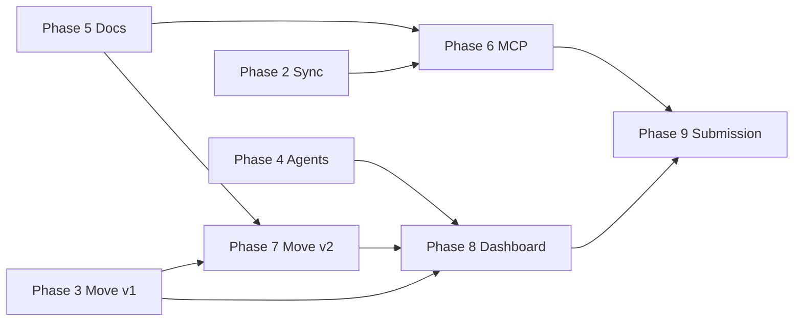

# ROADMAP — MemWal Agent Memory

**Project:** `memwal-agent-memory`
**Track:** Sui Overflow 2026 — Walrus Track
**Mainnet package:** `0x48db008a3c9e638dd17d20702632d9909c3c075e44eb339f890fb29503ec3050`
**Last updated:** May 31, 2026

> Canonical references: [`PROJECT.md`](PROJECT.md) · [`docs/ARCHITECTURE.md`](docs/ARCHITECTURE.md) · [`docs/specs/openspec-memwal-agent-memory.md`](docs/specs/openspec-memwal-agent-memory.md)

---

## Current snapshot

| Area | Status | Evidence |
|------|--------|----------|
| Monorepo + package DAG | **Complete** | `shared`, `local-memory`, `memwal-client`, `core`, `sui-contracts`, `ui`; ADR-013 |
| Hybrid memory (local + sync) | **Complete** | `MemorySyncService`, redaction, quality gate, Vitest |
| MemWal / Walrus durable layer | **Complete** | `@memwalpp/memwal-client`, `DurableMemoryStore` |
| Move contracts v1 (mainnet) | **Complete** | Package published; `sui move test`; [`docs/deploy.md`](docs/deploy.md) |
| Agent demos + hooks | **Mostly complete** | `pnpm agent:demo`, `pnpm agent:bounty-hunt`; stub bounty (no live PTB yet) |
| Project docs + OpenSpecs | **Complete** | Master + MCP + Move refactor specs; `PROJECT.md`, `ARCHITECTURE.md`, `ROADMAP.md` |
| MCP Server (`packages/mcp`) | **In progress** | stdio + HTTP scaffold; `remember`/`recall`/`search`/`sync` live |
| Move v2 refactor (upgrade-in-place) | **Planned** | Spec only — [`openspec-move-contracts-refactor.md`](docs/specs/openspec-move-contracts-refactor.md) |
| Dashboard live PTBs | **Planned** | UI exists; full wallet + chain flows not wired |

**Demo north star (all phases):** bounty → acquire → improve → fork → payout — every claim traceable to a **Walrus blob id** or **on-chain event**.

---

## Phase overview

| Phase | Milestone | Status | OpenSpec / doc |
|-------|-----------|--------|----------------|
| **0** | Project setup & monorepo | ✓ Complete | ADR-013, CI, `.env.example` |
| **1** | Foundation packages | ✓ Complete | `openspec-package-shared.md`, `openspec-package-local-memory.md`, `openspec-package-core.md` |
| **2** | MemWal integration + hybrid sync | ✓ Complete | `openspec-memwal-client.md`, `openspec-memory-sync-service.md`, `openspec-memwal-phase2-durable-sync.md` |
| **3** | Sui Move contracts v1 | ✓ Complete | `openspec-move-contracts.md`, mainnet publish |
| **4** | Autonomous agents + judge demos | ◐ Mostly complete | `openspec-agent-swarm-integration.md` |
| **5** | Documentation & project branding | ✓ Complete | `openspec-memwal-agent-memory.md`, `PROJECT.md`, `ARCHITECTURE.md`, `ROADMAP.md`, Walrus UI |
| **6** | MCP Server (universal access) | ◐ In progress | `packages/mcp` — stdio + core memory tools |
| **7** | Move contracts v2 refactor | ○ Planned | `openspec-move-contracts-refactor.md` |
| **8** | Dashboard + live chain integration | ○ Planned | PTBs, indexer, live bounty |
| **9** | Submission polish & judge experience | ○ Planned | `SUBMISSION.md`, `JUDGE_GUIDE.md`, demo video |

**Legend:** ✓ Complete · ◐ In progress / partial · ○ Planned

**Workflow (Phase 1+):** OpenSpec → GSD plan → Implement → Review → Acceptance.

---

## Phase details & exit criteria

### Phase 0 — Project setup ✓

| Exit criterion | Status |
|----------------|--------|
| Turborepo + pnpm workspaces | ✓ |
| `docs/ARCHITECTURE.md`, ADR-001 … ADR-013 | ✓ |
| CI (`pnpm check`, Move tests) | ✓ |
| `.env.example` (no secrets committed) | ✓ |

---

### Phase 1 — Foundation packages ✓

| Exit criterion | Status |
|----------------|--------|
| `@memwalpp/shared` — types only, no I/O | ✓ |
| `@memwalpp/local-memory` — SQLite + InMemory + quality scorer + redaction | ✓ |
| `@memwalpp/core` — orchestration surface (no circular deps) | ✓ |
| Acyclic package DAG (ADR-013) | ✓ |
| Vitest for `local-memory` | ✓ |

---

### Phase 2 — MemWal integration + hybrid sync ✓

| Exit criterion | Status |
|----------------|--------|
| `@memwalpp/memwal-client` facade over official MemWal SDK (no fork) | ✓ |
| `DurableMemoryStore` + env helpers (delegate key only, ADR-002) | ✓ |
| `MemorySyncService` — pushOne, pullQuery, syncPending, fullSync, softDelete | ✓ |
| Redaction before durable write (ADR-010) | ✓ |
| Conflict strategy: durable wins for sealed content | ✓ |
| Vitest coverage for sync paths | ✓ |

---

### Phase 3 — Sui Move contracts v1 ✓

| Exit criterion | Status |
|----------------|--------|
| Modules: `wal`, `memory_nft`, `marketplace`, `bounty`, `royalty`, `delegate_bridge`, `access_policy` | ✓ |
| Mainnet package published (identity preserved for judges) | ✓ |
| `deploy-manifest.json`, `Published.toml`, `docs/deploy.md` | ✓ |
| `@memwalpp/shared` constants + `pnpm contracts:info` | ✓ |
| `sui move test` green | ✓ |

**Published objects (judges):**

| Object | ID |
|--------|-----|
| Package | `0x48db008a3c9e638dd17d20702632d9909c3c075e44eb339f890fb29503ec3050` |
| Marketplace (shared) | `0x7dea19c34022cc7d28d21bfef75859bd6704f8fbd9bc7ea00c787052f895d548` |
| UpgradeCap | `0xada975edf109c28a8b74f3789312b90acef29aa7fa28a5e936dc489055e0fd66` |
| WAL TreasuryCap | `0xb9ee4a8bab47624f8ec343fd079c51fb54be60a8671affc7961da6e45badc41e` |

---

### Phase 4 — Autonomous agents + judge demos ◐

| Exit criterion | Status |
|----------------|--------|
| `MemWalAgentBridge` + swarm hooks (`beforeRemember`, `afterThink`, `onTaskComplete`) | ✓ |
| `pnpm agent:demo` — offline-safe, exit 0 without keys | ✓ |
| `pnpm agent:bounty-hunt` — 2-agent in-process swarm | ✓ |
| OpenClaw plugin manifest + skills (in-repo) | ✓ |
| Live Move bounty PTB in bounty-hunt | ○ Stub bounty today |
| Outcome events wired to real PTB batch (ADR-005) | ○ Partial (TS stub) |

**Remaining for Phase 4 complete:** wire `agent:bounty-hunt` to real `bounty::post_bounty` / `submit_fulfillment` PTBs when operator wallet + demo WAL are available.

---

### Phase 5 — Documentation & project branding ✓

| Exit criterion | Status |
|----------------|--------|
| Master OpenSpec (`openspec-memwal-agent-memory.md`) | ✓ |
| MCP Server OpenSpec (`openspec-mcp-server.md`) | ✓ |
| Move refactor OpenSpec (`openspec-move-contracts-refactor.md`) | ✓ |
| `PROJECT.md` (memwal-agent-memory branding) | ✓ |
| `docs/ARCHITECTURE.md` updated (MCP layer, OpenSpec links, package ID) | ✓ |
| `ROADMAP.md` (this file) | ✓ |
| Branding pass README / SUBMISSION / JUDGE_GUIDE / CHANGELOG (`MemWal++` = short name) | ✓ |
| Walrus design reference + dashboard dark/light UI | ✓ |
| Demo video slides + `agents.yaml` | ✓ |

---

### Phase 6 — MCP Server ◐

**Goal:** any MCP-compatible agent can use the hybrid memory layer without importing our packages.

| Exit criterion | Status |
|----------------|--------|
| `@memwalpp/mcp` package scaffolded | ✓ |
| stdio + HTTP transports | ✓ (stdio primary; HTTP via SSE) |
| Tools: `remember`, `recall`, `search`, `sync`, `promote`, `softDelete`, `verify`, `getStats` | ✓ |
| Chain tools (`createBounty`, `fulfillBounty`, …) | ○ stub → Sprint S4 |
| Redaction enforced server-side (no bypass) | ✓ (tests) |
| Claude Desktop / Cursor config examples | ○ |
| `pnpm mcp:start` root script | ✓ |

**Depends on:** Phase 2 (sync service), Phase 5 (spec locked).

---

### Phase 7 — Move contracts v2 refactor ○

**Goal:** upgrade-in-place on existing package ID — versioning + lineage via dynamic fields, stronger bounty + lineage royalty, indexer-friendly events.

| Exit criterion | Target |
|----------------|--------|
| New modules: `constants`, `events`, `admin`, `memory_ext`, `marketplace_v2`, `bounty_v2` | per refactor spec §3 |
| `MemoryPack` layout unchanged; `PackExt` via dynamic field | §4 |
| `fork_pack`, `buy_pack_v2`, `fulfill_bounty_v2`, multi-submission bounty | §5 |
| Upgrade via existing `UpgradeCap`; package id unchanged | §7 |
| Post-upgrade bootstrap (`Config`, `MarketplaceV2`, `AdminCap`) | §7.2 |
| `@memwalpp/shared` updated with new object ids + `moveTarget` entries | §8 |
| ≥ 8 new Move tests + all v1 tests still pass | §9 |

**Depends on:** Phase 3 (v1 published), Phase 5 (spec locked).

---

### Phase 8 — Dashboard + live chain integration ○

| Exit criterion | Target |
|----------------|--------|
| Dashboard wallet connect + list/buy MemoryPack PTBs | dApp Kit + `moveTarget()` |
| Bounty post / fulfill / approve from UI or CLI | real mainnet txs |
| Indexer worker against `indexer-schema.sql` | Kiosk + marketplace views |
| Scores in UI trace to on-chain events (ADR-005) | no SQLite-only self-report |
| Seal PTB composition (optional) | Mysten Seal package |

**Depends on:** Phase 3 (v1) or Phase 7 (v2 PTB targets), operator wallet for demos.

---

### Phase 9 — Submission polish ○

| Exit criterion | Target |
|----------------|--------|
| `SUBMISSION.md` + `JUDGE_GUIDE.md` aligned with memwal-agent-memory branding | judge-facing |
| End-to-end demo script with verifiable Walrus blob + on-chain event | `pnpm agent:demo` + dashboard |
| Demo video / slides updated | `docs/demo-video-slides.md` |
| All SDK imports exercised in demo or `pnpm demo` | ADR-012 |
| CI green: `pnpm check`, Vitest, `sui move test` | release gate |

---

## Dependency graph (phases 5–9)



Phases **6** (MCP) and **7** (Move v2) can run **in parallel** after Phase 5 specs are locked.

---

## Recommended execution order (next sprints)

| Sprint | Focus | Deliverable |
|--------|-------|-------------|
| **S1** ✓ | Docs + OpenSpecs | Master spec, MCP spec, Move refactor spec, `PROJECT.md`, `ARCHITECTURE.md`, `ROADMAP.md` |
| **S2** | MCP scaffold | `packages/mcp` — stdio transport, `remember`/`recall`/`sync` tools ◐ |
| **S3** | Move v2 implementation | `memory_ext`, `bounty_v2`, `marketplace_v2`; upgrade + bootstrap |
| **S4** | Live chain wiring | Dashboard PTBs; live bounty in `agent:bounty-hunt` |
| **S5** | Submission | Judge guide, demo polish, video |

---

## Post-hackathon backlog

| Item | Notes |
|------|-------|
| Full decentralized indexer | Lightweight schema exists; not a production network |
| OpenClaw plugin npm publish | In-repo manifest today |
| Real WAL bridging | Demo coin only |
| Multi-tenant MCP hosting | Out of scope for hackathon |
| Mobile / embedded agents | Non-goal |

---

## Judge quick links

| Resource | Path |
|----------|------|
| Judge guide | [`JUDGE_GUIDE.md`](JUDGE_GUIDE.md) |
| Submission brief | [`SUBMISSION.md`](SUBMISSION.md) |
| Deploy + interact | [`docs/deploy.md`](docs/deploy.md) |
| Architecture | [`docs/ARCHITECTURE.md`](docs/ARCHITECTURE.md) |
| Master OpenSpec | [`docs/specs/openspec-memwal-agent-memory.md`](docs/specs/openspec-memwal-agent-memory.md) |

**Judge commands:**

```bash
pnpm agent:demo          # hybrid memory demo (offline-safe)
pnpm agent:bounty-hunt   # 2-agent bounty swarm
pnpm contracts:info      # mainnet package + object IDs
pnpm run check           # TypeScript across monorepo
```
