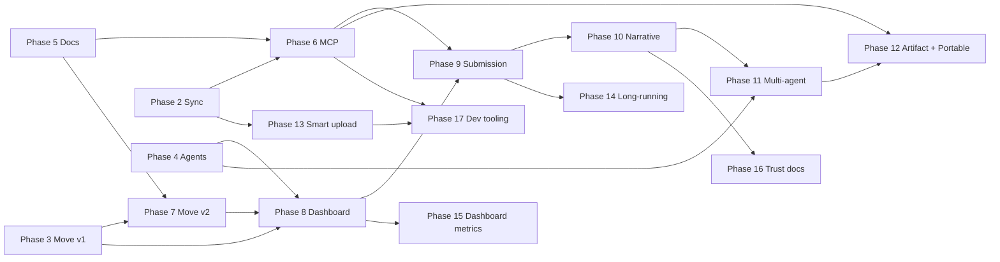

# ROADMAP — MemWal Agent Memory

**Project:** `memwal-agent-memory`
**Track:** Sui Overflow 2026 — Walrus Track
**Mainnet package:** `0x48db008a3c9e638dd17d20702632d9909c3c075e44eb339f890fb29503ec3050`
**Last updated:** June 13, 2026

> Canonical references: [`PROJECT.md`](PROJECT.md) · [`docs/ARCHITECTURE.md`](docs/ARCHITECTURE.md) · [`docs/specs/openspec-memwal-agent-memory.md`](docs/specs/openspec-memwal-agent-memory.md)

---

## Current snapshot

| Area | Status | Evidence |
|------|--------|----------|
| Monorepo + package DAG | **Complete** | `shared`, `local-memory`, `memwal-client`, `core`, `sui-contracts`, `ui`; ADR-013 |
| Hybrid memory (local + sync) | **Complete** | `MemorySyncService`, redaction, quality gate, Vitest |
| MemWal / Walrus durable layer | **Complete** | `@memwalpp/memwal-client`, `DurableMemoryStore` |
| Move contracts v1 (mainnet) | **Complete** | Package published; `sui move test`; [`docs/deploy.md`](docs/deploy.md) |
| Agent demos + hooks | **Mostly complete** | `pnpm agent:demo`, `pnpm agent:bounty-hunt`; optional live `postBounty` when chain env set |
| Project docs + OpenSpecs | **Complete** | Master + MCP + Move refactor specs; `PROJECT.md`, `ARCHITECTURE.md`, `ROADMAP.md` |
| MCP Server (`packages/mcp`) | **Complete** | stdio E2E; chain tools wired (`createBounty`, …) when delegate key + marketplace env set |
| Move v2 refactor (upgrade-in-place) | **Complete (mainnet)** | v2 modules + tests; upgrade v3 + bootstrap done |
| Dashboard live PTBs | **Partial** | Kiosk: post bounty, submit fulfillment, buy pack (v1 wallet PTBs) |

**Demo north star (all phases):** bounty → acquire → improve → fork → payout — every claim traceable to a **Walrus blob id** or **on-chain event**.

---

## Phase overview

| Phase | Milestone | Status | OpenSpec / doc |
|-------|-----------|--------|----------------|
| **0** | Project setup & monorepo | ✓ Complete | ADR-013, CI, `.env.example` |
| **1** | Foundation packages | ✓ Complete | `openspec-package-shared.md`, `openspec-package-local-memory.md`, `openspec-package-core.md` |
| **2** | MemWal integration + hybrid sync | ✓ Complete | `openspec-memwal-client.md`, `openspec-memory-sync-service.md`, `openspec-memwal-phase2-durable-sync.md` |
| **3** | Sui Move contracts v1 | ✓ Complete | `openspec-move-contracts.md`, mainnet publish |
| **4** | Autonomous agents + judge demos | ◐ Mostly complete | `openspec-agent-swarm-integration.md` |
| **5** | Documentation & project branding | ✓ Complete | `openspec-memwal-agent-memory.md`, `PROJECT.md`, `ARCHITECTURE.md`, `ROADMAP.md`, Walrus UI |
| **6** | MCP Server (universal access) | ✓ Complete | E2E: `pnpm mcp:e2e`; `.cursor/mcp.json` |
| **7** | Move contracts v2 refactor | ✓ Complete (mainnet) | `openspec-move-contracts-refactor.md`; bootstrapped 2026-06-01 |
| **8** | Dashboard + live chain integration | ◐ In progress | Kiosk v1 PTBs wired; indexer schema-only |
| **9** | Submission polish & judge experience | ✓ Complete | `SUBMISSION.md`, `JUDGE_GUIDE.md`, demo video |
| **10** | Walrus Track narrative polish | ✓ Complete | `openspec-walrus-track-gaps.md` Tier S |
| **11** | Multi-agent shared memory (Gap A) | ◐ Planned | `agent:shared-memory` |
| **12** | Artifacts + portable verify (Gap C, E) | ○ Planned | MCP `saveArtifact`, JUDGE Path D |
| **13** | Smart upload decision v1 (Gap D) | ○ Planned | `promote`, `MEMWAL_UPLOAD_THRESHOLD` |
| **14** | Long-running integration (Gap B) | ◐ Partial | companion doc + Tier S narrative |
| **15** | Dashboard Walrus metrics + benchmarks (G, H) | ○ Planned | dashboard panel, `docs/benchmarks/` |
| **16** | Trust model & Seal (Gap F) | ○ Planned | docs-first; see `walrus-memory-alignment.md` |
| **17** | Developer tooling expansion | ○ Planned | MCP profiles, auto-capture, FTS5 |

**Legend:** ✓ Complete · ◐ In progress / partial · ○ Planned

**Post-submit canonical spec:** [`docs/specs/openspec-walrus-track-gaps.md`](docs/specs/openspec-walrus-track-gaps.md)  
**Progress checklist:** [`docs/walrus-track-post-submit-checklist.md`](docs/walrus-track-post-submit-checklist.md)

**Workflow (Phase 1+):** OpenSpec → GSD plan → Implement → Review → Acceptance.

---

## Phase details & exit criteria

### Phase 0 — Project setup ✓

| Exit criterion | Status |
|----------------|--------|
| Turborepo + pnpm workspaces | ✓ |
| `docs/ARCHITECTURE.md`, ADR-001 … ADR-013 | ✓ |
| CI (`pnpm check`, Move tests) | ✓ |
| `.env.example` (no secrets committed) | ✓ |

---

### Phase 1 — Foundation packages ✓

| Exit criterion | Status |
|----------------|--------|
| `@memwalpp/shared` — types only, no I/O | ✓ |
| `@memwalpp/local-memory` — SQLite + InMemory + quality scorer + redaction | ✓ |
| `@memwalpp/core` — orchestration surface (no circular deps) | ✓ |
| Acyclic package DAG (ADR-013) | ✓ |
| Vitest for `local-memory` | ✓ |

---

### Phase 2 — MemWal integration + hybrid sync ✓

| Exit criterion | Status |
|----------------|--------|
| `@memwalpp/memwal-client` facade over official MemWal SDK (no fork) | ✓ |
| `DurableMemoryStore` + env helpers (delegate key only, ADR-002) | ✓ |
| `MemorySyncService` — pushOne, pullQuery, syncPending, fullSync, softDelete | ✓ |
| Redaction before durable write (ADR-010) | ✓ |
| Conflict strategy: durable wins for sealed content | ✓ |
| Vitest coverage for sync paths | ✓ |

---

### Phase 3 — Sui Move contracts v1 ✓

| Exit criterion | Status |
|----------------|--------|
| Modules: `wal`, `memory_nft`, `marketplace`, `bounty`, `royalty`, `delegate_bridge`, `access_policy` | ✓ |
| Mainnet package published (identity preserved for judges) | ✓ |
| `deploy-manifest.json`, `Published.toml`, `docs/deploy.md` | ✓ |
| `@memwalpp/shared` constants + `pnpm contracts:info` | ✓ |
| `sui move test` green | ✓ |

**Published objects (judges):**

| Object | ID |
|--------|-----|
| Package | `0x48db008a3c9e638dd17d20702632d9909c3c075e44eb339f890fb29503ec3050` |
| Marketplace (shared) | `0x7dea19c34022cc7d28d21bfef75859bd6704f8fbd9bc7ea00c787052f895d548` |
| UpgradeCap | `0xada975edf109c28a8b74f3789312b90acef29aa7fa28a5e936dc489055e0fd66` |
| WAL TreasuryCap | `0xb9ee4a8bab47624f8ec343fd079c51fb54be60a8671affc7961da6e45badc41e` |

---

### Phase 4 — Autonomous agents + judge demos ◐

| Exit criterion | Status |
|----------------|--------|
| `MemWalAgentBridge` + swarm hooks (`beforeRemember`, `afterThink`, `onTaskComplete`) | ✓ |
| `pnpm agent:demo` — offline-safe, exit 0 without keys | ✓ |
| `pnpm agent:bounty-hunt` — 2-agent in-process swarm | ✓ |
| OpenClaw plugin manifest + skills (in-repo) | ✓ |
| Live Move bounty PTB in bounty-hunt | ○ Stub bounty today |
| Outcome events wired to real PTB batch (ADR-005) | ○ Partial (TS stub) |

**Remaining for Phase 4 complete:** wire `agent:bounty-hunt` to real `bounty::post_bounty` / `submit_fulfillment` PTBs when operator wallet + demo WAL are available.

---

### Phase 5 — Documentation & project branding ✓

| Exit criterion | Status |
|----------------|--------|
| Master OpenSpec (`openspec-memwal-agent-memory.md`) | ✓ |
| MCP Server OpenSpec (`openspec-mcp-server.md`) | ✓ |
| Move refactor OpenSpec (`openspec-move-contracts-refactor.md`) | ✓ |
| `PROJECT.md` (memwal-agent-memory branding) | ✓ |
| `docs/ARCHITECTURE.md` updated (MCP layer, OpenSpec links, package ID) | ✓ |
| `ROADMAP.md` (this file) | ✓ |
| Branding pass README / SUBMISSION / JUDGE_GUIDE / CHANGELOG (`MemWal++` = short name) | ✓ |
| Walrus design reference + dashboard dark/light UI | ✓ |
| Demo video slides + `agents.yaml` | ✓ |

---

### Phase 6 — MCP Server ✓

**Goal:** any MCP-compatible agent can use the hybrid memory layer without importing our packages.

| Exit criterion | Status |
|----------------|--------|
| `@memwalpp/mcp` package scaffolded | ✓ |
| stdio + HTTP transports | ✓ |
| Tools: `remember`, `recall`, `search`, `sync`, `promote`, `softDelete`, `verify`, `getStats` | ✓ |
| Chain tools (`createBounty`, `fulfillBounty`, …) | ✓ wired — live when `SUI_DELEGATE_PRIVATE_KEY` + marketplace env set |
| Redaction enforced server-side (no bypass) | ✓ |
| Claude Desktop / Cursor config + E2E test | ✓ |
| `pnpm mcp:start` / `pnpm mcp:e2e` | ✓ |

**Depends on:** Phase 2 (sync service), Phase 5 (spec locked).

---

### Phase 7 — Move contracts v2 refactor ✓ (mainnet)

**Goal:** upgrade-in-place on existing package ID — versioning + lineage via dynamic fields, stronger bounty + lineage royalty, indexer-friendly events.

| Exit criterion | Target |
|----------------|--------|
| New modules: `constants`, `events`, `admin`, `memory_ext`, `marketplace_v2`, `bounty_v2` | per refactor spec §3 ✓ |
| `MemoryPack` layout unchanged; `PackExt` via dynamic field | §4 ✓ |
| `fork_pack`, `buy_pack_v2`, `fulfill_bounty_v2`, multi-submission bounty | §5 ✓ |
| Upgrade via existing `UpgradeCap`; package id unchanged | §7 ✓ mainnet (published-at 0x9de4…) |
| Post-upgrade bootstrap (`Config`, `MarketplaceV2`, `AdminCap`) | §7.2 ✓ mainnet (tx BjV2Q8m…) |
| `@memwalpp/shared` updated with new object ids + `moveTarget` entries | §8 ✓ |
| ≥ 8 new Move tests + all v1 tests still pass | §9 ✓ (7 v2 + 1 v1) |

**Depends on:** Phase 3 (v1 published), Phase 5 (spec locked).

---

### Phase 8 — Dashboard + live chain integration ◐

| Exit criterion | Target |
|----------------|--------|
| Dashboard wallet connect + list/buy MemoryPack PTBs | dApp Kit + `moveTarget()` |
| Bounty post / fulfill / approve from UI or CLI | real mainnet txs |
| Indexer worker against `indexer-schema.sql` | Kiosk + marketplace views |
| Scores in UI trace to on-chain events (ADR-005) | no SQLite-only self-report |
| Seal PTB composition (optional) | Mysten Seal package |

**Depends on:** Phase 3 (v1) or Phase 7 (v2 PTB targets), operator wallet for demos.

---

### Phase 9 — Submission polish ✓

| Exit criterion | Target |
|----------------|--------|
| `SUBMISSION.md` + `JUDGE_GUIDE.md` aligned with memwal-agent-memory branding | judge-facing |
| End-to-end demo script with verifiable Walrus blob + on-chain event | `pnpm agent:demo` + dashboard |
| Demo video / slides updated | `docs/demo-video-slides.md` |
| All SDK imports exercised in demo or `pnpm demo` | ADR-012 |
| CI green: `pnpm check`, Vitest, `sui move test` | release gate |

---

### Phase 10 — Walrus Track narrative polish ✓

**Goal:** Map every official track pillar to a judge-verifiable command or URL — minimal code.

**Tier:** S · **Spec:** [`openspec-walrus-track-gaps.md`](docs/specs/openspec-walrus-track-gaps.md) §5 Tier S

| Exit criterion | Status |
|----------------|--------|
| SUBMISSION §3 track pillar → evidence table | ✓ |
| Doc Hub scoring lens + track map (`#track-map`) | ✓ |
| Special One elevated as long-running proof (README + SUBMISSION §3.1) | ✓ |
| Demo video storyboard: 3-agent + verify (README addendum) | ✓ |
| “Integrate in 5 minutes” in `docs/mcp-setup.md` | ✓ |

**Completed:** 2026-06-27 · Checklist: [`walrus-track-post-submit-checklist.md`](docs/walrus-track-post-submit-checklist.md)

---

### Phase 11 — Multi-agent shared memory (Gap A) ◐

**Goal:** Judges see **three agents** sharing context via the same Walrus namespace/blob — not only sequential steps in one process.

| Exit criterion | Status |
|----------------|--------|
| `pnpm agent:shared-memory` — Research → Analyst → Executor | ○ |
| Summary table: `agentId \| memoryId \| walrusBlobId \| hitSource` | ○ |
| Analyst/Executor `pullQuery` with `forceDurable: true` | ○ |
| `JUDGE_GUIDE.md` Path D (optional second process) | ○ |
| Offline exit 0; live blob with `MEMWAL_AUTO_PUSH=1` | ○ |

**Depends on:** Phase 2 (sync), Phase 4 (agent bridge). **Preserves:** `agent:bounty-hunt`.

---

### Phase 12 — Artifacts + portable verify (Gap C, E) ○

**Goal:** Artifact-driven workflow + 5-minute portable memory proof for judges.

| Exit criterion | Status |
|----------------|--------|
| MCP tool `saveArtifact` (text/JSON/markdown) | ○ |
| Demo: save report → promote → second agent recall | ○ |
| `JUDGE_GUIDE.md` Path D — export → fresh DB → recall → verify PASS | ○ |
| `pnpm mcp:e2e:portable` or extended E2E | ○ |
| Doc Hub 60s verify includes portable step | ○ |

**Depends on:** Phase 6 (MCP), Phase 11 (shared demo integration optional).

---

### Phase 13 — Smart upload decision v1 (Gap D) ○

**Goal:** Intelligent hybrid sync v1 — not full 6-factor engine; extends existing quality gate.

| Exit criterion | Status |
|----------------|--------|
| `RememberOptions.promote`: `auto` \| `local` \| `walrus` | ○ |
| Metadata boosts: `@walrus`, `@local`, `important`, bounty roles | ○ |
| `accessCount` on local rows; used in upload score | ○ |
| `MEMWAL_UPLOAD_THRESHOLD` (default 65) in `.env.example` | ○ |
| `shouldUploadToWalrus()` + logged reason in `pushOne` | ○ |
| Unit tests for promote modes and PII hard block | ○ |

**Reference:** MemWal Hybrid MCP research · [`sovereign-memory-roadmap-discussion.md`](docs/product/sovereign-memory-roadmap-discussion.md) Phase 10.

---

### Phase 14 — Long-running integration (Gap B) ◐

**Goal:** Main repo narrative + optional stub for “resume session”; production proof stays in Special One.

| Exit criterion | Status |
|----------------|--------|
| Companion doc bidirectional links | ○ |
| SUBMISSION/README hero link to Special One | ◐ (partial in SUBMISSION) |
| Optional `agent:resume-session` stub | ○ |
| Demo video “long-running” chapter | ○ |

**Companion:** [`docs/companion-mvp-special-one-agent.md`](docs/companion-mvp-special-one-agent.md)

---

### Phase 15 — Dashboard Walrus metrics + benchmarks (Gap G, H) ○

| Exit criterion | Status |
|----------------|--------|
| Dashboard panel: blobs promoted, verify status, namespace count | ○ |
| Links to memory.walrus.xyz + Suiscan | ○ |
| Kiosk labeled “indexer pending” (no fake listings) | ○ |
| `docs/benchmarks/hybrid-memory.md` | ○ |
| Optional `pnpm bench:recall` | ○ |

**Depends on:** Phase 8 (dashboard shell). Indexer E2E remains P3 backlog.

---

### Phase 16 — Trust model & Seal (Gap F) ○

**Goal:** Document trust boundaries; defer MemWalManual wire-up.

| Exit criterion | Status |
|----------------|--------|
| Trust model table in SUBMISSION + Doc Hub | ○ |
| `walrus-memory-alignment.md` linked from PROJECT | ◐ |
| Optional MemWalManual spike ADR | ○ |

---

### Phase 17 — Developer tooling expansion ○

**Goal:** Competitive polish from Phase 1.2 research — after Tier A complete.

| Exit criterion | Status |
|----------------|--------|
| MCP profiles (cursor, claude-desktop, openclaw) | ○ |
| Auto-capture hooks (oc-memwal alignment) | ○ |
| SQLite FTS5 hybrid search mode | ○ |
| Optional `examples/crewai_memwal.py` snippet | ○ |

**Explicitly deferred:** Full CrewAI/LangGraph adapters, Streamable HTTP MCP, `analyze`/`ask` facade — see [`walrus-memory-alignment.md`](docs/walrus-memory-alignment.md).

---

## Dependency graph (phases 5–17)



Phases **10** (narrative) and **11** (multi-agent) are the **highest priority** post-submit.  
Phases **12–13** (Tier A) follow. **15–17** (Tier B) can run in parallel when capacity allows.

---

## Recommended execution order (post-submit sprints)

| Sprint | Focus | Deliverable | Tier |
|--------|-------|-------------|------|
| **S6** | Track narrative | SUBMISSION map, Doc Hub, Special One hero, mcp-setup 5-min | S | ✓ |
| **S7** | Multi-agent demo | `pnpm agent:shared-memory`, JUDGE Path D draft | A |
| **S8** | Artifacts + portable | `saveArtifact`, `mcp:e2e:portable`, Path D complete | A |
| **S9** | Smart upload v1 | `promote`, threshold, accessCount, tests | A |
| **S10** | Long-running + resume stub | companion links, optional `agent:resume-session` | S + B |
| **S11** | Dashboard + benchmarks | Walrus panel, `docs/benchmarks/hybrid-memory.md` | B |
| **S12** | Trust docs + MCP profiles | Phase 16 + 17 starter | B |

Prior sprints S1–S5 (submission) are **complete** — see table above.

---

## Recommended execution order (pre-submit sprints — archive)

| Sprint | Focus | Deliverable |
|--------|-------|-------------|
| **S1** ✓ | Docs + OpenSpecs | Master spec, MCP spec, Move refactor spec, `PROJECT.md`, `ARCHITECTURE.md`, `ROADMAP.md` |
| **S2** | MCP scaffold + E2E | `packages/mcp` — stdio, memory tools, `pnpm mcp:e2e` ✓ |
| **S3** ✓ | Move v2 implementation | `memory_ext`, `bounty_v2`, `marketplace_v2`; `sui move test` green — **mainnet upgrade + bootstrap → S4** |
| **S4** ✓ | Live chain wiring | Chain PTB client, MCP + agent-swarm + kiosk wallet PTBs; v2 mainnet bootstrap complete |
| **S5** ✓ | Submission | Judge guide, demo slides, mainnet ids synced |

---

## Post-hackathon backlog

| Item | Notes | Spec / phase |
|------|-------|--------------|
| **Walrus Track gaps (active)** | Phases 10–17 — checklist drives progress | [`openspec-walrus-track-gaps.md`](docs/specs/openspec-walrus-track-gaps.md) · [`walrus-track-post-submit-checklist.md`](docs/walrus-track-post-submit-checklist.md) |
| **Sovereign Memory roadmap (draft)** | Vault, Auditor LLM, Consolidator — R&D horizon | [`docs/product/sovereign-memory-roadmap-discussion.md`](docs/product/sovereign-memory-roadmap-discussion.md) |
| Walrus Memory SDK gaps | `analyze`, `ask`, MemWalManual | [`docs/walrus-memory-alignment.md`](docs/walrus-memory-alignment.md) P2 |
| Full decentralized indexer | Schema only | P3 · Phase 8 |
| OpenClaw plugin npm publish | In-repo manifest today | Phase 17 |
| Real WAL bridging | Demo coin only | Non-goal |
| Multi-tenant MCP hosting | Out of scope | Non-goal |
| Mobile / embedded agents | Non-goal | PROJECT.md |
| zk-proof / heavy PoI | Deferred | openspec §6 |
| Full CrewAI / LangGraph adapters | Snippet only | openspec §6 |

---

## Judge quick links

| Resource | Path |
|----------|------|
| Judge guide | [`JUDGE_GUIDE.md`](JUDGE_GUIDE.md) |
| Submission brief | [`SUBMISSION.md`](SUBMISSION.md) |
| Deploy + interact | [`docs/deploy.md`](docs/deploy.md) |
| Architecture | [`docs/ARCHITECTURE.md`](docs/ARCHITECTURE.md) |
| Master OpenSpec | [`docs/specs/openspec-memwal-agent-memory.md`](docs/specs/openspec-memwal-agent-memory.md) |
| Walrus Track gaps spec | [`docs/specs/openspec-walrus-track-gaps.md`](docs/specs/openspec-walrus-track-gaps.md) |
| Post-submit checklist | [`docs/walrus-track-post-submit-checklist.md`](docs/walrus-track-post-submit-checklist.md) |

**Judge commands:**

```bash
pnpm agent:demo          # hybrid memory demo (offline-safe)
pnpm agent:bounty-hunt   # 2-agent bounty swarm
pnpm agent:shared-memory # 3-agent shared Walrus context (Phase 11 — planned)
pnpm mcp:e2e             # MCP stdio integration
pnpm contracts:info      # mainnet package + object IDs
pnpm run check           # TypeScript across monorepo
```
