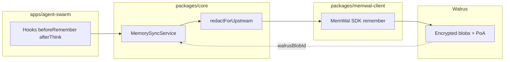

# MemWal++ — system architecture

**Status:** canonical reference for implementation and reviews (ưu tiên đọc cho **Cursor / AI agents** trước khi sửa code).  
**Diagram:** [`diagrams/memwalpp-merged-architecture.svg`](diagrams/memwalpp-merged-architecture.svg) (`memwalpp_merged_architecture.svg`).  
**Decisions:** [`decisions/`](decisions/) (ADR-001 … ADR-013). **Monorepo boundaries:** [ADR-013 — Monorepo layout](decisions/ADR-013.md).

---

## 1. Purpose

MemWal++ is a **Walrus-track** submission for **Sui Overflow 2026**: a **verifiable memory economy** where agents can **capture**, **score**, **persist**, **trade**, and **prove** memories—combining **local-first** speed and privacy with **Walrus + MemWal** durability and **Sui Move** for ownership, marketplace, bounties, and royalties.

### 1.1 Text diagram (dependency direction, top → bottom)

```
[ apps/dashboard ]     [ apps/agent-swarm ]     [ apps/cli ]
        |                       |                      |
        +-----------+-----------+----------------------+
                    v
            [ packages/core ]
                    |
        +-----------+-----------+
        v                       v
 [ packages/memwal-client ]   [ packages/local-memory ]
        |                       |
        v                       v
 [ @mysten-incubation/memwal ]  SQLite / vectors / scorers
        |
        v
              Walrus / relayer (external)

[ packages/shared ]  <── imported by many; imports nothing internal
[ packages/ui ]      <── may use shared only

[ packages/sui-contracts ]  Move only; TS apps depend for PTB IDs / ABIs
```

**Rule of thumb:** apps never imported by `packages/*`. `shared` has no workspace deps. See **ADR-013** for the full responsibility matrix.

---

## 2. Layered model (merged diagram)

### Layer A — Experience

**Actors:** end user, developer, hackathon judge.  
**Surfaces:** Sui wallet, marketplace UI, Memory Kiosk, operator dashboard.

| Concern | Implementation |
|---------|----------------|
| Wallet connect | `@mysten/dapp-kit` in `apps/dashboard` |
| Browse / buy / list | Next.js routes; PTB composition against `packages/sui-contracts` package ID |
| Kiosk | UI + indexer-backed data (ADR-009); schema [`specs/indexer-schema.sql`](specs/indexer-schema.sql) |

### Layer B — Orchestration (NemoClaw / OpenClaw)

**Role:** policy-bound agent swarm; MemWal plugin (`oc-memwal`); custom skills; bounty skill.

| Concern | Implementation |
|---------|----------------|
| Hooks | `@memwalpp/core` **`MemWalAgentBridge`** — `beforeRemember` / `afterThink` / `onTaskComplete` (ADR-011); delegates **`MemorySyncService`** (redact + gate + push) |
| Skills & demos | `apps/agent-swarm` — OpenClaw plugin manifest, skills, **`pnpm agent:demo`**, **`pnpm agent:bounty-hunt`** |
| Agent contract | `IMemWalAgent` in `memwal-client`; implementation in **`core/agent/MemWalAgentBridge.ts`** |

### Layer C — Hybrid memory system

**Local half:** SQLite + vectors; fast recall; offline cache; curation (agentmemory / memoirs adapters in `packages/local-memory`).  
**Durable half:** MemWal SDK + Walrus blobs + Seal-oriented flows + PoA; namespaces; lineage metadata (`packages/memwal-client`).

**Sync rule (ADR-010):** promote to Walrus/MemWal only after **quality + PII** gates; on conflict, **durable layer wins** for sealed content.

### Layer D — Sui blockchain + Walrus storage

**Move (`packages/sui-contracts`):**

| Module | Responsibility |
|--------|----------------|
| `memory_nft` | `MemoryPack` NFT, delegate slot, royalty bps |
| `marketplace` | Shared `Marketplace`, list/buy, WAL splits, events |
| `royalty` | Fee / royalty basis-point helpers |
| `wal` | Package-local `WAL` coin for demo economics |
| `bounty` | Escrow, lifecycle, events (ADR-008) |
| `delegate_bridge` | Rotate `memwal_delegate` + event (compose with MemWal PTBs off-chain) |
| `access_policy` | Delegate-only seal approval signal + event |

**Walrus:** encrypted blobs, erasure coding, PoA, Seal key gating — underpins MemWal storage narrative.

### Layer D — Move contracts reference

**Package:** `0x48db008a3c9e638dd17d20702632d9909c3c075e44eb339f890fb29503ec3050` · [`deploy.md`](deploy.md) · [`specs/openspec-move-contracts.md`](specs/openspec-move-contracts.md)

| Module | Key objects / flows | Walrus link |
|--------|---------------------|-------------|
| `memory_nft` | `MemoryPack` — `blob_ids`, `poa_proofs`, `memwal_delegate` | Stores Walrus object ids on-chain |
| `marketplace` | Shared `Marketplace` — list/buy in package `WAL` | Pack sale references blob metadata |
| `bounty` | Shared `Bounty` — **WAL escrow** | `submit_fulfillment(walrus_blob_id)` |
| `delegate_bridge` | `DelegateRotated` event | Off-chain MemWal PTB composition |
| `access_policy` | `SealAccessGranted` | Delegate must match pack |
| `wal` | OTW + `TreasuryCap` at publish | Demo settlement coin |
| `royalty` | 250 bps marketplace fee | Pure math |

**TS constants:** `@memwalpp/shared` — `MARKETPLACE_PACKAGE_ID`, `moveTarget()`, `MAINNET_DEPLOYED_OBJECTS`.

---

## 3. Data flows (demo-critical)

1. **Agent turn** → hooks → **local scoring** → if pass → **encrypted write** via MemWal → Walrus.  
2. **Listing** → mint/list **MemoryPack** + Walrus metadata for preview (ADR-004).  
3. **Bounty hunter** → scan chain bounties → local eval → acquire memory → improve → **fork** with royalty path.  
4. **Verification** → Walrus proof + **on-chain / indexed** metrics (ADR-005 — no pure self-report).

---

## 4. Monorepo mapping

| Path | Layer |
|------|--------|
| `apps/dashboard` | A |
| `apps/agent-swarm` | B |
| `apps/cli` | ops / demos |
| `packages/memwal-client` | B ↔ C (durable) |
| `packages/local-memory` | C (local) |
| `packages/core` | domain orchestration |
| `packages/shared` | **cross-cutting types** — no I/O |
| `packages/sui-contracts` | D (Move) |
| `packages/ui` | shared React |
| `docs/` | ADRs, specs, diagrams (`docs/specs/` = OpenSpec-style contracts) |
| `.cursor/rules/` | Cursor agent constraints (always-on + style) |

---

## 5. Cross-cutting policies

- **ADR-013:** monorepo layout, package boundaries, naming — **read before adding imports**.  
- **ADR-001:** self-hosted MemWal relayer for production demo path.  
- **ADR-002:** delegate signing keys only in app env.  
- **ADR-003:** mainnet artifacts for judges when required.  
- **ADR-005:** scores surfaced in UI trace to **on-chain events** / contract rules.  
- **ADR-012:** disclose AI-assisted tooling in README and submissions.

---

## 6. Integration boundaries

| System | Boundary |
|--------|----------|
| Mysten MemWal | Do not fork; wrap via SDK + relayer URL. |
| Seal | Access composition in PTBs / app; `access_policy.move` emits audit events only. |
| NemoClaw | Out-of-repo install; this repo supplies plugin contract + hooks. |

---

## 7. Security summary

- No owner keys in repo; MemWal **delegate** keys in local env only.  
- PII strip before any durable write.  
- WAL used in Move is **package-minted demo coin** unless explicitly bridged.

---

## 8. Walrus Track highlights (judge narrative)

MemWal++ satisfies the Walrus track by placing **durable agent memory on Walrus** via the official MemWal path, while keeping day-to-day agent work **local-first**.



| Walrus requirement | How MemWal++ addresses it |
|--------------------|---------------------------|
| Durable blob storage | MemWal `remember` → Walrus blob id on `MemoryRecord.walrusBlobId` |
| Verifiable recall | `pullQuery` / MemWal semantic recall hydrates local cache |
| Agent integration | `pnpm agent:demo`, `pnpm agent:bounty-hunt` — not dead code |
| Privacy before upload | `redactForUpstream` in sync layer before any durable write |
| On-chain economy | Move package (marketplace, bounty, NFT) + outcome events (ADR-005) |

**Judge commands:** see [`../SUBMISSION.md`](../SUBMISSION.md) and README § Quick start.

---

## 9. Related documents

| Document | Use |
|----------|-----|
| [`../PROJECT.md`](../PROJECT.md) | Vision, goals, non-goals |
| [`../ROADMAP.md`](../ROADMAP.md) | Phased milestones + exit criteria |
| [`README.md`](../README.md) | Contributor entry, scripts, package ID |
| [`GIT-AND-VERSIONING.md`](GIT-AND-VERSIONING.md) | Branch + tag + version policy |
| [`CLAUDE.md`](CLAUDE.md) | AI assistant commands and guardrails |
| [`SOURCE-memwalpp.md`](SOURCE-memwalpp.md) | Original planning notes |
| [`decisions/`](decisions/) | ADRs |
| [`specs/phase1-import-dag.md`](specs/phase1-import-dag.md) | Phase 1 foundation — package DAG + implement order |
| [`specs/openspec-package-shared.md`](specs/openspec-package-shared.md) | Phase 1 — `shared` OpenSpec |
| [`specs/openspec-package-core.md`](specs/openspec-package-core.md) | Phase 1 — `core` OpenSpec |
| [`specs/openspec-package-local-memory.md`](specs/openspec-package-local-memory.md) | Phase 1 — `local-memory` OpenSpec |
| [`specs/openspec-memwal-client.md`](specs/openspec-memwal-client.md) | MemWal client facade (Phase 2a — implemented) |
| [`specs/openspec-memwal-phase2-durable-sync.md`](specs/openspec-memwal-phase2-durable-sync.md) | Phase 2 — durable store + bidirectional sync |
| [`process/plans/memwal-phase2-gsd.md`](process/plans/memwal-phase2-gsd.md) | Phase 2 GSD implementation plan |
| [`specs/openspec-agent-swarm-integration.md`](specs/openspec-agent-swarm-integration.md) | Phase 3 agent swarm + hooks |
| [`specs/openspec-wave4-submission.md`](specs/openspec-wave4-submission.md) | Wave 4 submission polish |
| [`specs/openspec-move-contracts.md`](specs/openspec-move-contracts.md) | Phase 3 Move contracts |
| [`deploy.md`](deploy.md) | Mainnet deploy + interact |
| [`process/plans/phase3-gsd.md`](process/plans/phase3-gsd.md) | Phase 3 GSD |
| [`../SUBMISSION.md`](../SUBMISSION.md) | Hackathon submission brief |
| [`specs/indexer-schema.sql`](specs/indexer-schema.sql) | Kiosk / marketplace indexer |
