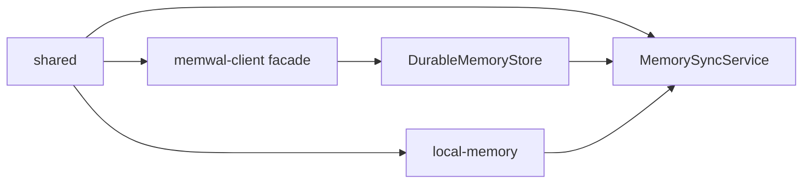

# GSD plan — Phase 2: MemWal durable + bidirectional sync

**OpenSpec:** [`openspec-memwal-phase2-durable-sync.md`](../../specs/openspec-memwal-phase2-durable-sync.md)  
**DAG:** Add **`core` → `local-memory`** (one-way); keep **`memwal-client` ↛ `local-memory`**.

---

## Wave 0 — Docs & types (no behavior change)

| # | Task | Package | Deps |
|---|------|---------|------|
| 0.1 | Mark `openspec-memwal-client.md` as “facade complete”; link Phase 2 spec | docs | — |
| 0.2 | Extend `MemoryRecord.metadata` keys in shared docs only (optional constants in `shared`) | shared | — |
| 0.3 | Add `core` dependency on `@memwalpp/local-memory` in `package.json` | core | ADR-013 update |

---

## Wave 1 — Durable layer (`memwal-client`)

| # | Task | Files | Deps |
|---|------|-------|------|
| 1.1 | Error types: `MemWalTransportError`, `MemWalAuthError` + `is*` guards | `errors.ts` | — |
| 1.2 | `retry.ts` — exponential backoff helper (pure) | `retry.ts` | — |
| 1.3 | `durable-memory-store.ts` — `DurableMemoryStore` + `createDurableMemoryStore` | new | 1.1–1.2, `MemWalService` |
| 1.4 | Wire offline: durable store wraps offline `MemWalService` (reject on use) | durable | 1.3 |
| 1.5 | Barrel `index.ts` exports | index | 1.3 |
| 1.6 | Vitest: mapping + retry mock (no network) | `tests/` | 1.3 |

**Exit:** `pnpm --filter @memwalpp/memwal-client check` + tests green.

---

## Wave 2 — Sync orchestration (`core`) ✓

**OpenSpec:** [`openspec-memory-sync-service.md`](../../specs/openspec-memory-sync-service.md)

| # | Task | Files | Status |
|---|------|-------|--------|
| 2.1 | `sync-config.ts` — quality min, namespace, conflict strategy | `core/src/memory/sync-config.ts` | ✓ |
| 2.2 | `merge.ts` — durable hits → `MemoryRecord` + tombstone/upstream flags | `core/src/memory/merge.ts` | ✓ |
| 2.3 | `memory-sync-service.ts` — `pushOne`, `pullQuery`, `syncPending`, `fullSync`, `softDelete` | `core/src/memory/memory-sync-service.ts` | ✓ |
| 2.4 | `sync-queue.ts`, `sync-metrics.ts`, `sync-logger.ts`, `sync-errors.ts` | `core/src/memory/` | ✓ |
| 2.5 | `createMemorySyncService` + barrel exports | `core/src/index.ts` | ✓ |
| 2.6 | Vitest: redact, gate, merge, syncPending, offline | `core/tests/memory-sync-service.test.ts` | ✓ |

**Exit:** `pnpm --filter @memwalpp/core check` + `pnpm --filter @memwalpp/core test` green.

---

## Wave 3 — Integration & docs

| # | Task | Deps |
|---|------|------|
| 3.1 | Optional: thin adapter in `apps/agent-swarm` or `cli` demo script calling `MemorySyncService` | 2.x |
| 3.2 | Update `docs/ARCHITECTURE.md` § sync + link OpenSpec | — |
| 3.3 | Update `packages/memwal-client/README.md` — durable vs sync ownership | — |
| 3.4 | `pnpm run check` + `pnpm test` monorepo | all |

---

## Dependency graph (implementation order)

---

## Risks & mitigations

| Risk | Mitigation |
|------|------------|
| MemWal SDK has no delete | Tombstone metadata only in Phase 2; document in OpenSpec |
| Seal not ready | Reserve metadata keys; no PTB in this phase |
| `core` → `local-memory` new edge | Update ADR-013 + phase1-import-dag in same PR |
| CI without MemWal keys | Offline durable + mock tests; integration manual |

---

## Done when

- All Wave 1–3 exit criteria met.
- OpenSpec §9 acceptance rows checked.
- No circular imports (`memwal-client` does not import `core` or `local-memory`).
