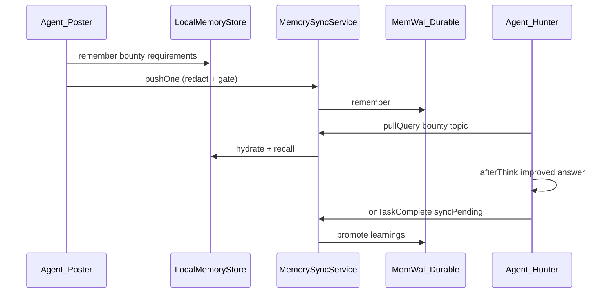

# OpenSpec — Phase 3 / Wave 3: Agent swarm integration & judge demos

**Change ID:** `agent-swarm-wave3`  
**Status:** Draft (approved for implementation after review)  
**Extends:** [`openspec-memory-sync-service.md`](openspec-memory-sync-service.md), [`openspec-memwal-phase2-durable-sync.md`](openspec-memwal-phase2-durable-sync.md)  
**ADRs:** ADR-005 (outcomes), ADR-010 (hybrid sync), ADR-011 (hooks), ADR-013 (app boundaries)

---

## 1. Problem

Phase 2 delivered **`MemorySyncService`** (local ↔ MemWal) in `@memwalpp/core`, but **`apps/agent-swarm`** is still a placeholder. Judges and integrators need a **runnable end-to-end story**:

> Post bounty → agent recalls hybrid memory → improves answer → captures locally → redacts → promotes to MemWal when quality passes.

NemoClaw / OpenClaw run **out of repo**; this repo ships the **contract**, **hooks**, **skills manifest**, and **CLI demos** that external orchestrators can load.

---

## 2. Goals & non-goals

### Goals

| ID | Goal |
|----|------|
| G1 | Wire `MemorySyncService` into agent lifecycle hooks |
| G2 | Implement `MemWalAgentBridge` satisfying `IMemWalAgent` + swarm hooks |
| G3 | CLI: `pnpm agent:demo`, `pnpm agent:bounty-hunt` (offline-safe without keys) |
| G4 | Minimal swarm: **2 agents** (poster + hunter) with scripted bounty flow |
| G5 | Judge docs: ARCHITECTURE + README quick start with demo commands |

### Non-goals (Wave 3)

| Item | Deferred |
|------|----------|
| Full NemoClaw install / sandbox | Out-of-repo; link only |
| Live Move bounty PTB | Phase 3 Move; demo uses **stub bounty** object + events |
| Production OpenClaw plugin publish | In-repo `plugin/` manifest + README install steps |
| Multi-tenant auth | Single namespace per demo run |

---

## 3. Package boundaries

```
apps/agent-swarm
  → @memwalpp/core          (MemorySyncService, toOutcomeEvent)
  → @memwalpp/local-memory  (InMemoryLocalMemoryStore default for demos)
  → @memwalpp/memwal-client (MemWalClient.tryFromEnv, durable)
  → @memwalpp/shared

apps/agent-swarm MUST NOT be imported by packages/*
memwal-client MUST NOT import agent-swarm or local-memory
```

**Orchestration lives in the app.** `core` stays framework-agnostic; hook *names* for OpenClaw are implemented in `agent-swarm` and may alias ADR-011 types in `memwal-client`.

---

## 4. Hook model

### 4.1 Naming map (OpenClaw ↔ ADR-011)

| OpenClaw / product name | ADR-011 (`memwal-client`) | When | Sync behavior |
|-------------------------|---------------------------|------|---------------|
| **`beforeRemember`** | `beforeModelCall` | Before LLM / think step | `pullQuery` → inject top-k snippets into prompt |
| **`afterThink`** | `afterModelCall` | After model output | `local.remember` draft → optional `pushOne` if auto-sync |
| **`onTaskComplete`** | *(app extension)* | Bounty/task finished | `syncPending` → `pushOne` for task memory ids → `toOutcomeEvent` stub |

### 4.2 `MemWalSwarmHooks` (agent-swarm)

```ts
export interface SwarmHookContext extends HookContext {
  agentId: string;
  taskId?: string;
  bountyId?: string; // stub ObjectId in demo
}

export interface MemWalSwarmHooks {
  beforeRemember(ctx: SwarmHookContext, prompt: string): Promise<string>;
  afterThink(ctx: SwarmHookContext, response: string): Promise<void>;
  onTaskComplete(ctx: SwarmHookContext, summary: string): Promise<void>;
}
```

### 4.3 `beforeRemember` — recall path

1. `sync.pullQuery(extractQuery(prompt), { namespace: ctx.namespace, limit: k })`
2. Format hits as `## Memory context\n- ...` block **prepended** to prompt (cap tokens ~2k chars for demo).
3. Never inject raw PII: hits are already local or hydrated; durable path went through merge + prior redact on push.
4. If durable offline → local-only recall (no throw).

### 4.4 `afterThink` — capture path

1. Build `MemoryRecord` from `response` (truncate demo max 8k chars).
2. `local.remember(record)` always.
3. If `autoPushAfterThink` (default **false** in demo, **true** in bounty-hunt when `MEMWAL_AUTO_PUSH=1`):
   - `sync.pushOne(record.id)` → redact + gate + durable inside service.
4. Log skip reasons (`gate`, `offline`) at `info` — no content logging (ADR-002).

### 4.5 `onTaskComplete` — sync + outcome

1. `sync.syncPending({ namespace })`
2. For each `taskMemoryId` in ctx → `pushOne` if not synced
3. `toOutcomeEvent({ packId, scoreDelta, proofDigest })` — log JSON for future PTB (ADR-005)
4. Emit demo `console` summary for judges

---

## 5. `MemWalAgentBridge`

Implements `IMemWalAgent<SwarmHookContext>` by delegating to `MemorySyncService`:

| `IMemWalAgent` method | Implementation |
|----------------------|----------------|
| `beforeModelCall` | → `beforeRemember` |
| `afterModelCall` | → `afterThink` |
| `saveMemory` | `local.remember` + optional `pushOne` |
| `queryMemory` | `pullQuery` → `string[]` content |
| `exportPack` | demo: collect `synced` rows with `walrusBlobId` |
| `importPack` | demo: no-op + log (Move import Phase 4) |

Factory:

```ts
export function createMemWalAgentBridge(deps: {
  sync: MemorySyncService;
  local: LocalMemoryStore;
  config?: AgentBridgeConfig;
}): MemWalAgentBridge;
```

---

## 6. Demo flows

### 6.1 End-to-end judge narrative



### 6.2 `pnpm agent:demo` (happy path, offline OK)

| Step | Action |
|------|--------|
| 1 | Seed local memory: "Sui bounty requires verifiable Walrus proof" |
| 2 | `beforeRemember` on prompt "How do we fulfill the bounty?" |
| 3 | Simulated think response (no external LLM) |
| 4 | `afterThink` capture |
| 5 | If `MEMWAL_*` set → `pushOne` + print blob id; else print `offline` |
| 6 | `onTaskComplete` + outcome JSON |
| **Exit 0** | Always (demo must not fail CI without keys) |

### 6.3 `pnpm agent:bounty-hunt` (2-agent swarm)

| Agent | Role |
|-------|------|
| **poster** | Posts stub bounty metadata to local store; pushes requirement memory |
| **hunter** | `pullQuery` → integrates context → writes improvement memory → `onTaskComplete` |

Shared `MemorySyncService` instance over one `InMemoryLocalMemoryStore` (in-process swarm). Optional env `MEMWAL_AUTO_PUSH=1` for live promotion.

Stub bounty:

```ts
const DEMO_BOUNTY = {
  id: "0x…01" as ObjectId,
  title: "Improve Walrus verification narrative",
  rewardWal: 100,
  namespace: "bounty-demo",
};
```

---

## 7. OpenClaw plugin / skills (in-repo)

### 7.1 Layout

```
apps/agent-swarm/
  plugin/
    openclaw.plugin.json      # id, entry, hook registration manifest (stub)
  skills/
    memwal-sync/SKILL.md      # push/pull/syncPending usage
    bounty-hunt/SKILL.md      # poster + hunter flow
  src/
    index.ts                  # re-exports
    bridge/memwal-agent-bridge.ts
    hooks/memwal-swarm-hooks.ts
    swarm/demo.ts
    swarm/bounty-hunt.ts
    cli/run-demo.ts
    cli/run-bounty-hunt.ts
```

### 7.2 Plugin contract (documented, not npm-published in Wave 3)

- **Plugin id:** `memwalpp-oc-memwal`
- **Hooks registered:** `beforeRemember`, `afterThink`, `onTaskComplete`
- **Install note in README:** copy `apps/agent-swarm/plugin` into OpenClaw plugins dir OR run CLI demos without OpenClaw

---

## 8. CLI & root scripts

| Script | Runs |
|--------|------|
| `pnpm agent:demo` | `pnpm --filter agent-swarm run demo` |
| `pnpm agent:bounty-hunt` | `pnpm --filter agent-swarm run bounty-hunt` |

`apps/agent-swarm/package.json`:

```json
{
  "scripts": {
    "demo": "tsx src/cli/run-demo.ts",
    "bounty-hunt": "tsx src/cli/run-bounty-hunt.ts",
    "check": "tsc --noEmit"
  }
}
```

Add `tsx` as devDependency on `agent-swarm` (or use root `tsx` via `pnpm exec`).

---

## 9. Error handling

| Scenario | Behavior |
|----------|----------|
| Durable offline | Continue local-only; print clear banner |
| Quality gate fail | Skip push; show `reason: gate` in demo output |
| Empty recall | `beforeRemember` returns prompt unchanged |
| Invalid record id | `SyncError` caught; log warn, continue swarm |
| Uncaught exception in demo CLI | Exit 1 only for programmer errors; not for missing MemWal env |

---

## 10. Documentation updates (Wave 3 acceptance)

| Doc | Updates |
|-----|---------|
| `docs/ARCHITECTURE.md` | Layer B: point to `agent-swarm` hooks + link this spec |
| `README.md` | Quick start: `pnpm agent:demo`, env table, judge flow §6 |
| `ROADMAP.md` | Phase 4 agent exit criteria → partial ✓ when demos pass |

---

## 11. Success criteria

| Check | PASS |
|-------|------|
| OpenSpec (this doc) | ✓ |
| `MemWalAgentBridge` + hooks | ✓ |
| `pnpm agent:demo` exit 0 offline | ✓ |
| `pnpm agent:bounty-hunt` 2-agent log | ✓ |
| ARCHITECTURE + README updated | ✓ |
| `pnpm run check` green | ✓ |
| No secrets in logs/commits | ✓ |

---

## 12. Implementation order (GSD preview)

1. `agent-swarm` deps: `core`, `local-memory`, `tsx`
2. `createMemWalAgentBridge` + `createMemWalSwarmHooks`
3. `run-demo.ts`, `run-bounty-hunt.ts`
4. Root `package.json` scripts
5. `plugin/` + `skills/` markdown
6. Docs + manual judge walkthrough

---

## 13. References

- [`openspec-memory-sync-service.md`](openspec-memory-sync-service.md)
- [`ADR-011`](../decisions/ADR-011.md)
- [`packages/memwal-client/src/imemwal-agent.ts`](../../packages/memwal-client/src/imemwal-agent.ts)
- [`packages/memwal-client/src/hooks.ts`](../../packages/memwal-client/src/hooks.ts)
