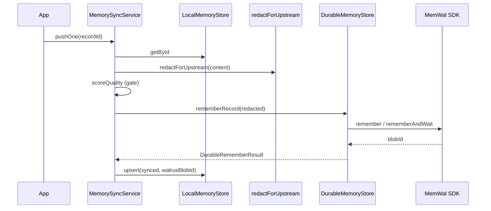

# OpenSpec — Phase 2: Durable verifiable storage (MemWal + bidirectional sync)

**Change ID:** `memwal-phase2-durable-sync`  
**Status:** Draft (approved for implementation)  
**Supersedes / extends:** [`openspec-memwal-client.md`](openspec-memwal-client.md) (facade v1 — **done**)  
**ADRs:** [ADR-002](../decisions/ADR-002.md), [ADR-005](../decisions/ADR-005.md), [ADR-010](../decisions/ADR-010.md), [ADR-013](../decisions/ADR-013.md)

---

## 1. Problem

Phase 1 delivered **local-first** storage (`@memwalpp/local-memory`) and a thin **MemWal facade** (`MemWalService`). Phase 2 must close the loop:

- **Promote** quality-gated, **redacted** memories to MemWal/Walrus (durable truth).
- **Hydrate** local cache from MemWal **recall** for fast agent turns.
- Preserve **local-first** UX while honoring **ADR-010** (durable layer wins on sealed conflict).

Encryption (Seal) and on-chain lineage are **composed at orchestration / PTB layers** in later phases; Phase 2 defines **hooks and metadata slots**, not full Seal PTB implementation.

---

## 2. Package boundaries (mandatory)

| Layer | Package | Owns |
|-------|---------|------|
| Durable I/O | `@memwalpp/memwal-client` | `MemWalService` (existing), **`DurableMemoryStore`**, record ↔ blob mapping, retries at MemWal boundary |
| Local I/O | `@memwalpp/local-memory` | `LocalMemoryStore`, `redactForUpstream`, `scoreQuality` |
| **Sync orchestration** | `@memwalpp/core` | **`MemorySyncService`** — local ↔ durable, quality gate, redact-before-push, merge-on-recall |

**Forbidden:** `memwal-client` → `local-memory` (ADR-013). Apps may call `core` or compose both packages explicitly.

---

## 3. `DurableMemoryStore` (memwal-client)

### 3.1 Responsibility

Typed durable plane over `MemWalService`, using **`MemoryRecord`** from `@memwalpp/shared` (not SQLite).

- Does **not** run PII redaction (caller / `core` runs `redactForUpstream` first).
- Does **not** implement local cache.
- Maps MemWal job/blob identifiers onto `MemoryRecord.walrusBlobId` and `synced: true`.

### 3.2 Interface

```ts
export interface DurableRememberResult {
  jobId?: string;
  blobId?: string;
  recordId: string;
}

export interface DurableRecallHit {
  text: string;
  blobId?: string;
  /** Optional SDK metadata when available */
  metadata?: Record<string, string>;
}

export interface DurableMemoryStore {
  readonly isLive: boolean;

  /** Push plaintext (already redacted) to MemWal; returns updated durable refs. */
  rememberRecord(
    record: MemoryRecord,
    opts?: { namespace?: string; wait?: boolean },
  ): Promise<DurableRememberResult>;

  /** Semantic recall; returns snippets + blob ids when present. */
  recall(
    query: string,
    opts?: { namespace?: string; limit?: number },
  ): Promise<DurableRecallHit[]>;

  /**
   * Phase 2: logical delete = tombstone in metadata + optional future MemWal API.
   * v2.0: if SDK has no delete, set local tombstone flag only on returned record shape
   * and document no remote purge until API exists.
   */
  deleteByRecordId(recordId: string, opts?: { namespace?: string }): Promise<void>;

  destroy(): void;
}

export function createDurableMemoryStore(
  service: MemWalService,
  defaults?: { namespace?: string; waitForRemember?: boolean },
): DurableMemoryStore;
```

### 3.3 Mapping rules

| Field | Rule |
|-------|------|
| `rememberRecord` input | `record.content` must be non-empty after trim; `record.id` stable (UUID or app-generated). |
| `walrusBlobId` | Set from `blobId` when `rememberAndWait` or completed job exposes blob id. |
| `metadata` | Serialize allowed keys to MemWal namespace side-channel only if SDK supports; else keep in local store only (documented). |
| `recall` | Map SDK results → `DurableRecallHit[]`; empty query → `RangeError`. |

### 3.4 Error handling & retry (durable boundary)

| Error | Type | Behavior |
|-------|------|----------|
| Missing config / offline service | `MemWalConfigError` | Propagate; no retry |
| Network / 5xx / rate limit | `MemWalTransportError` (new) | Retry with exponential backoff: **3 attempts**, base **500ms**, jitter, cap **8s** |
| 4xx auth | `MemWalAuthError` (new) | Fail fast; no retry |
| Invalid input | `RangeError` / `LocalMemoryError` pattern | No retry |

Retries apply to **`rememberRecord`** and **`recall`** only; idempotent recall is safe. **`rememberRecord`** retry must use same `record.id` so local row can reconcile.

### 3.5 Encryption & Seal (Phase 2 scope)

| Item | Phase 2 |
|------|---------|
| MemWal SDK encryption | Rely on **MemWal + Walrus** path as provided by Mysten SDK (delegate auth ADR-002). |
| Seal PTBs | **Out of scope** — `MemoryRecord.metadata` may include `sealPolicyId?: string` for future PTBs. |
| Pre-push | **Mandatory** `redactForUpstream` in sync layer (`core`), not in `DurableMemoryStore`. |

---

## 4. Bidirectional sync strategy (`MemorySyncService` in core)

### 4.1 Principles (ADR-010)

1. **Local-first read:** `recall` queries **local store** first; optional **background or on-demand** durable fetch.
2. **Promotion gate:** Local → durable only if `allowUpstreamSync !== false` (space), `scoreQuality >= threshold`, and redaction flags acceptable.
3. **Conflict:** If local row `synced` and durable blob exists, **durable content wins** for merge; local keeps `localQualityScore` for debugging only.
4. **Lineage:** Each promotion appends `metadata.lineageParentId` / `metadata.promotedAtMs` (string values).

### 4.2 Sync modes

| Mode | Behavior |
|------|----------|
| `pushOne(recordId)` | Load local → redact → score gate → `rememberRecord` → upsert local with `synced: true`, `walrusBlobId` |
| `pullQuery(query, namespace)` | `durable.recall` → merge into local (`upsert`); return merged `MemoryRecord[]` |
| `syncPending(namespace?)` | All local rows with `synced: false` and passing gate → `pushOne` (batch, sequential default) |
| `hydrateOnRecall` | If local recall empty or `forceDurable`, call durable recall then merge |

### 4.3 Merge algorithm (durable → local)

For each `DurableRecallHit`:

1. Derive `id` = stable hash of `blobId` if present, else hash of `text` + namespace (documented function in code).
2. If local row exists and `synced` with different content → **replace content** from durable; set `metadata.mergedFrom = "durable"`.
3. If no row → insert new `MemoryRecord` with `synced: true`, `createdAtMs = now`.

### 4.4 Config (env + options)

| Var / option | Default | Purpose |
|------------|---------|---------|
| `MEMWAL_*` | (existing) | Durable client |
| `MEMWAL_SYNC_QUALITY_MIN` | `40` | Min `scoreQuality` to promote |
| `MEMWAL_SYNC_WAIT` | mirrors `MEMWAL_WAIT_FOR_REMEMBER` | Wait for blob id on push |
| `qualityMin` (constructor) | env or 40 | Override threshold |

### 4.5 Sequence (local → durable)



---

## 5. Extended `MemWalService` (optional Phase 2.1)

Keep existing API stable. Add only if needed by hooks:

- `search(query, limit)` alias to `recall` (documented).
- `waitForJob(jobId)` wrapper for async remembers.

**Delete:** expose `deleteByRecordId` on `DurableMemoryStore` only until SDK supports remote delete.

---

## 6. Versioning & lineage (metadata contract)

Stored in `MemoryRecord.metadata` (string map):

| Key | Meaning |
|-----|---------|
| `lineageParentId` | Prior record id or blob id |
| `promotedAtMs` | Epoch ms when pushed to MemWal |
| `redactFlags` | Comma-separated `piiFlags` from redaction |
| `contentVersion` | Monotonic integer per record id (increment on each local edit) |
| `sealPolicyId` | Reserved; empty in Phase 2 |

---

## 7. Non-functional

| ID | Requirement |
|----|-------------|
| N1 | Strict TS; no `any` |
| N2 | ADR-002: never log keys or raw pre-redaction content at info level |
| N3 | `pnpm run check` green without MemWal env (offline durable store rejects like `MemWalService`) |
| N4 | Unit tests: durable store with mock `MemWalService`; sync with in-memory local + mock durable |
| N5 | No new cycle: `core` may depend on `local-memory`; `memwal-client` must not |

---

## 8. Success criteria

1. `DurableMemoryStore` implemented and exported from `@memwalpp/memwal-client`.
2. `MemorySyncService` implemented in `@memwalpp/core` with `pushOne`, `pullQuery`, `syncPending`.
3. Redaction always runs before `rememberRecord` in sync path.
4. `docs/ARCHITECTURE.md` updated with sync layer diagram (Phase 2 subsection).
5. Vitest coverage for merge + gate logic (core) and durable mapping (memwal-client).

---

## 9. Acceptance (binary)

| Check | PASS |
|-------|------|
| OpenSpec + GSD plan reviewed | ☐ |
| DurableMemoryStore + errors + retry | ☐ |
| MemorySyncService + core → local-memory dep | ✓ |
| Tests pass locally / CI | ☐ |
| DAG acyclic per ADR-013 | ☐ |

---

## 10. Related

- [`openspec-memwal-client.md`](openspec-memwal-client.md) — facade v1
- [`openspec-package-local-memory.md`](openspec-package-local-memory.md)
- [`openspec-package-core.md`](openspec-package-core.md)
- [`phase1-import-dag.md`](phase1-import-dag.md)
- Plan: [`../process/plans/memwal-phase2-gsd.md`](../process/plans/memwal-phase2-gsd.md)
