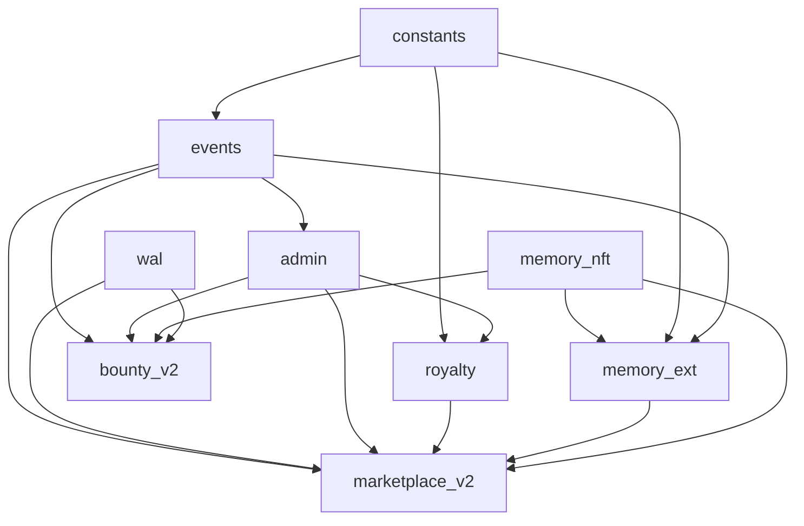
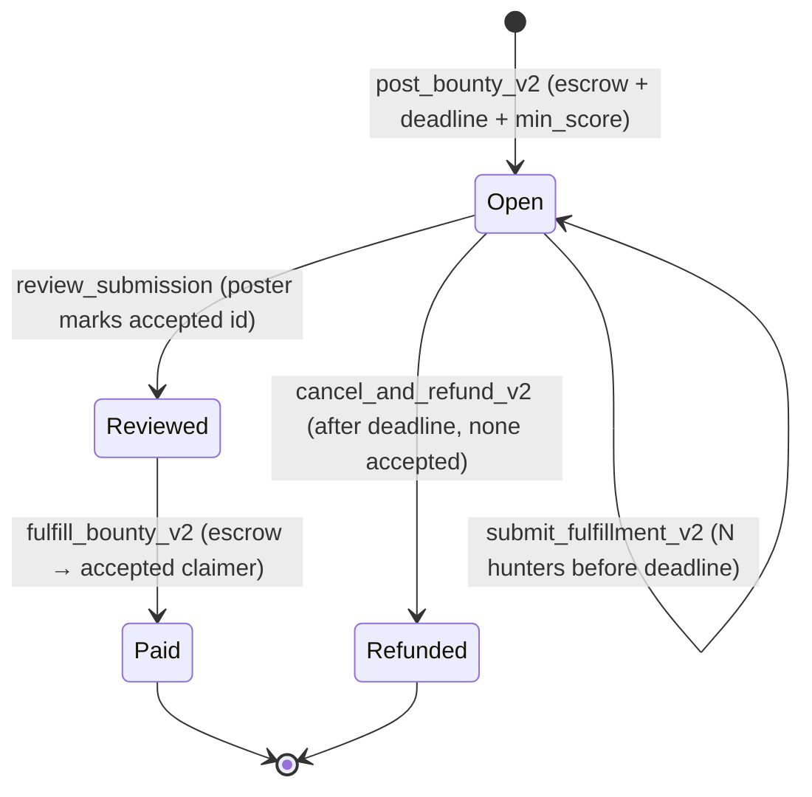

# OpenSpec — Sui Move Contracts Refactor (`memwal-agent-memory`)

**Change ID:** `move-contracts-refactor-v2`
**Status:** Draft (proposed — in-place upgrade, package identity preserved)
**Package:** `packages/sui-contracts` (`memwalpp_contracts`)
**Strategy:** **Upgrade-in-place** — keep current Package ID + UpgradeCap; **no struct layout changes**; new pack data via **Dynamic Fields**; new logic via **`*_v2` functions**.
**ADRs:** ADR-003 (mainnet), ADR-004 (metadata), ADR-005 (outcomes), ADR-006 (namespace), ADR-008 (bounty), ADR-011 (delegate)
**Master spec:** [`openspec-memwal-agent-memory.md`](openspec-memwal-agent-memory.md) §8 · **Baseline:** [`openspec-move-contracts.md`](openspec-move-contracts.md)

> **Hard rule:** the published package `0x48db…3050` and its `UpgradeCap` `0xada9…fd66` are
> immutable identities for judges and `@memwalpp/shared`. This refactor is **purely additive**:
> add modules, add functions, attach data via dynamic fields. **Nothing published is removed,
> renamed, or relaid-out.**

---

## 1. Current State & Constraints

### 1.1 Published identity (immutable)

| Object | ID | Constraint |
|--------|-----|-----------|
| **Package** | `0x48db008a3c9e638dd17d20702632d9909c3c075e44eb339f890fb29503ec3050` | Must stay the same after upgrade |
| **UpgradeCap** | `0xada975edf109c28a8b74f3789312b90acef29aa7fa28a5e936dc489055e0fd66` | Sole upgrade authority (operator) |
| **Marketplace** (shared) | `0x7dea19c34022cc7d28d21bfef75859bd6704f8fbd9bc7ea00c787052f895d548` | Stable shared object — reused as-is |
| **WAL TreasuryCap** | `0xb9ee4a8bab47624f8ec343fd079c51fb54be60a8671affc7961da6e45badc41e` | Demo WAL mint |
| Toolchain | Sui 1.70.2, edition 2024 | |

### 1.2 Published modules (v1 — frozen surface)

| Module | Public surface that MUST remain | Published struct (layout frozen) |
|--------|----------------------------------|----------------------------------|
| `wal` | `init` | `WAL` OTW |
| `memory_nft` | `mint_pack`, `burn_pack`, `id`, `creator`, `royalty_bps`, `set_listed`, `memwal_delegate`, `share_to_sender` | `MemoryPack` (12 fields — **frozen**) |
| `marketplace` | `list_pack`, `cancel_listing`, `buy_pack` | `Marketplace { prices, sellers }` |
| `royalty` | `marketplace_fee_bps`, `take_fee`, `take_royalty` | — (constants only) |
| `bounty` | `post_bounty`, `submit_fulfillment`, `approve_fulfillment`, `cancel_and_refund` | `Bounty { … completed }` |
| `delegate_bridge` | `rotate_memwal_delegate` | — |
| `access_policy` | `seal_approve_for_blob` | — |

### 1.3 Immutable struct: `memory_nft::MemoryPack`

```
namespace, blob_ids, pack_type, creator, poa_proofs,
performance_score, is_listed, royalty_bps, memwal_delegate
(+ id: UID)
```

> Sui upgrade rules: **cannot add/remove/reorder fields** of a published struct. Therefore
> `version`, `lineage`, and `content_hash` are **NOT** added to `MemoryPack`. They are attached
> as **dynamic fields** keyed on the pack's `UID` (§4).

### 1.4 Upgrade compatibility rules (what governs this refactor)

| Allowed (additive) | Forbidden |
|--------------------|-----------|
| Add new modules | Remove a published module |
| Add new public functions | Remove/rename a published public function |
| Add new structs / events | Change signature of a published function |
| Attach dynamic fields to existing objects | Add/remove/reorder fields of a published struct |
| Read existing objects in new code | Change ability set of a published struct |

---

## 2. Refactor Objectives

| ID | Objective | Why |
|----|-----------|-----|
| R1 | **Preserve package identity** (ID + UpgradeCap) | Judges, mainnet history, `@memwalpp/shared` constants stay valid (ADR-003) |
| R2 | **Add versioning + lineage + content_hash** without touching `MemoryPack` layout | Verifiable fork/improve economy (master §6) via **Dynamic Fields** |
| R3 | **`*_v2` function family** for new logic/fields | Add capability without breaking v1 callers |
| R4 | **Stronger Bounty system** — multi-submission + explicit review | Richer agentic-web demo (ADR-008) |
| R5 | **Stronger Royalty** — creator royalty **+ lineage royalty** to ancestors | Fair memory economy |
| R6 | **Indexer-friendly Events** — centralized, consistent naming | Stable dashboards (ADR-005) |
| R7 | **Clean module structure** — `constants`, `events`, `admin` extracted | Maintainability, no magic numbers |
| R8 | **Tunable policy via `admin::Config` + `AdminCap`** | Change fee/pause without re-publish |
| R9 | **Readable, view-friendly** getters for TS PTB composition | Clean integration |

**Compatibility principle:** every new capability is reachable through **new** functions; every
new field lives in a **dynamic field** or a **new** struct. v1 entry functions remain callable
and pass their original tests.

---

## 3. Proposed Module Structure + Responsibility Table

```
packages/sui-contracts/sources/
├── constants.move        # NEW: bps denom, caps, error codes, df key bytes
├── events.move           # NEW: all event structs + public(package) emit_* helpers
├── admin.move            # NEW: AdminCap (owned) + Config (shared): fee bps, royalty cap, paused
├── memory_ext.move       # NEW: dynamic-field extension for MemoryPack (version/lineage/content_hash) + fork
├── marketplace_v2.move   # NEW: Listing model + buy_pack_v2 (live Config fee + lineage royalty)
├── bounty_v2.move        # NEW: multi-submission + review + fulfill_bounty_v2
│
├── wal.move              # KEPT (frozen)
├── memory_nft.move       # KEPT (frozen) — v1 MemoryPack + mint/burn
├── marketplace.move      # KEPT (frozen) — v1 list/buy
├── bounty.move           # KEPT (frozen) — v1 single-shot bounty
├── royalty.move          # EXTENDED additively — add lineage helpers (no signature change to v1 fns)
├── delegate_bridge.move  # KEPT (frozen)
└── access_policy.move    # KEPT (frozen)
```

> Naming choice: new behavior lives in **new modules** (`memory_ext`, `marketplace_v2`,
> `bounty_v2`) rather than mutating published modules. This keeps published modules' diffs
> minimal and the upgrade obviously-compatible. `royalty.move` only **gains** new public
> functions (additive), never edits existing ones.

### 3.1 Responsibility table

| Module | Status | Owns | Depends on |
|--------|--------|------|-----------|
| `constants` | new | `BPS_DENOM=10000`, `MAX_ROYALTY_BPS`, `MAX_FORK_DEPTH`, error codes, DF key bytes (`b"memwal_ext"`) | — |
| `events` | new | All event structs + `public(package) emit_*` helpers | `constants` |
| `admin` | new | `AdminCap` (owned), `Config` (shared): `marketplace_fee_bps`, `max_royalty_bps`, `paused`, `version` | `constants`, `events` |
| `memory_ext` | new | `PackExt` dynamic field (version, lineage, content_hash); `attach_ext`, `bump_version`, `fork_pack` | `memory_nft`, `constants`, `events` |
| `marketplace_v2` | new | `Listing` record; `list_pack_v2`, `update_price`, `buy_pack_v2` (Config fee + lineage royalty) | `memory_nft`, `memory_ext`, `royalty`, `admin`, `wal`, `events` |
| `bounty_v2` | new | `BountyV2` + `Submission`; `post_bounty_v2`, `submit_fulfillment_v2`, `review_submission`, `fulfill_bounty_v2`, `cancel_and_refund_v2` | `wal`, `memory_nft`, `admin`, `events` |
| `royalty` | extended | adds `distribute_lineage_royalty`, `split_fee_and_royalties` | `constants`, `admin` |
| `wal` / `memory_nft` / `marketplace` / `bounty` / `delegate_bridge` / `access_policy` | kept | v1 frozen surface | — |

### 3.2 Dependency graph (acyclic)



---

## 4. Key Objects & Dynamic Fields Strategy

### 4.1 The problem & the chosen pattern

`MemoryPack` layout is frozen. To enrich packs we attach a **single companion struct** as a
dynamic field keyed on the pack `UID`. One key (not many) keeps reads/writes predictable and
gas bounded.

| Decision | Choice |
|----------|--------|
| DF mechanism | `sui::dynamic_field` (value field, not object) — companion is plain `store` data |
| Key | `constants::EXT_KEY` = `b"memwal_ext"` (single namespaced key per pack) |
| Attach point | `memory_ext::attach_ext(pack: &mut MemoryPack, …)` |
| v1 packs (no ext) | Treated as `version=1`, empty lineage, `content_hash` absent — readers default gracefully |

### 4.2 `memory_ext::PackExt` (dynamic field value)

| Field | Type | Notes |
|-------|------|-------|
| `version` | `u32` | starts at 1; `bump_version` increments |
| `content_hash` | `vector<u8>` | commitment to current `blob_ids` set |
| `lineage` | `Lineage` | fork ancestry |
| `updated_at_ms` | `u64` | from `Clock` |

### 4.3 `memory_ext::Lineage`

| Field | Type | Notes |
|-------|------|-------|
| `parent` | `Option<ID>` | direct parent pack (None = original) |
| `root` | `Option<ID>` | original ancestor (None = self is root) |
| `fork_depth` | `u16` | asserted `≤ MAX_FORK_DEPTH` |
| `ancestors` | `vector<address>` | creators eligible for lineage royalty (length-capped) |

### 4.4 Dynamic field API

| Function | Signature (informal) | Effect |
|----------|----------------------|--------|
| `attach_ext` | `(&mut MemoryPack, content_hash, clock, ctx)` | Create `PackExt{version:1,…}` if absent; idempotent guard |
| `has_ext` | `(&MemoryPack): bool` | DF presence check |
| `get_version` | `(&MemoryPack): u32` | returns `1` if no ext |
| `bump_version` | `(&mut MemoryPack, new_content_hash, clock)` | `version += 1`; updates hash; emits `MemoryVersioned` |
| `fork_pack` | `(&MemoryPack parent, new_blob_ids, content_hash, royalty_bps, clock, ctx): MemoryPack` | Mints child via `memory_nft::mint_pack`, attaches ext with derived lineage; emits `PackForked` |
| `read_lineage` | `(&MemoryPack): Lineage` | for marketplace royalty + TS reads |

**`fork_pack` lineage derivation:**
- `parent_ext = read_lineage(parent)` (or default for v1 packs)
- `child.parent = some(id(parent))`
- `child.root = parent_ext.root ?? some(id(parent))`
- `child.fork_depth = parent_ext.fork_depth + 1` → assert `≤ MAX_FORK_DEPTH`
- `child.ancestors = cap(parent_ext.ancestors ++ [parent.creator], MAX_FORK_DEPTH)`

### 4.5 `marketplace_v2::Listing`

| Field | Type | Notes |
|-------|------|-------|
| `pack_id` | `ID` | escrowed pack (DOF under shared `Marketplace` or a new `MarketplaceV2`) |
| `seller` | `address` | |
| `price_mist` | `u64` | WAL mist |
| `listed_at_ms` | `u64` | from `Clock` |

> Escrow may reuse the existing shared `Marketplace` (add a `listings: Table<ID, Listing>` via…
> — **not possible**, `Marketplace` layout is frozen). **Therefore** `marketplace_v2` introduces
> its own shared `MarketplaceV2` object (new struct, created post-upgrade by `admin` bootstrap),
> keeping v1 `Marketplace` untouched. v1 listings continue on the old object.

### 4.6 `bounty_v2` objects

| `BountyV2` field | Type | Notes |
|------------------|------|-------|
| `id` | `UID` | shared |
| `poster` | `address` | |
| `wal_escrow` | `Balance<WAL>` | |
| `deadline_ms` | `u64` | |
| `description_hash` | `vector<u8>` | |
| `min_score` | `u8` | optional quality hint |
| `submissions` | `vector<Submission>` | multiple hunters |
| `accepted` | `Option<ID>` | accepted submission id |
| `completed` | `bool` | terminal |

| `Submission` field | Type |
|--------------------|------|
| `submission_id` | `ID` |
| `claimer` | `address` |
| `walrus_blob_id` | `ID` |
| `pack_id` | `Option<ID>` |
| `submitted_at_ms` | `u64` |

### 4.7 `admin` objects

| Object | Kind | Role |
|--------|------|------|
| `AdminCap` | owned | operator authority for config |
| `Config` | shared | `marketplace_fee_bps: u16`, `max_royalty_bps: u16`, `paused: bool`, `version: u16` |

Created post-upgrade via `admin::bootstrap(&UpgradeCap-gated entry)` (since `init` only runs at
first publish). Functions: `set_fee_bps`, `set_max_royalty_bps`, `set_paused` — all `&AdminCap`
gated, all emit `ConfigUpdated`.

---

## 5. Bounty & Royalty Flow (v2 improvements)

### 5.1 Bounty v2 lifecycle (multi-submission)



| Step | Function | Actor | Rules |
|------|----------|-------|-------|
| 1 | `post_bounty_v2(coin, deadline_ms, description_hash, min_score, config, clock, ctx)` | poster | `amount>0`, `deadline>now`, `!config.paused` |
| 2 | `submit_fulfillment_v2(bounty, walrus_blob_id, pack_id?, clock, ctx)` | hunter | before deadline, not completed; appends `Submission`; emits `FulfillmentSubmitted` |
| 3 | `review_submission(bounty, submission_id, accept: bool, ctx)` | poster | poster-only; sets/clears `accepted`; emits `FulfillmentReviewed` |
| 4a | `fulfill_bounty_v2(bounty, ctx)` | poster | requires `accepted` set; pays full escrow → accepted claimer; `completed=true`; emits `BountyPaid` |
| 4b | `cancel_and_refund_v2(bounty, clock, ctx)` | poster | after deadline AND `accepted` is none; refund → poster; emits `BountyCancelled` |

**Invariants:** single terminal transition; escrow fully paid or fully refunded (no dust kept);
`walrus_blob_id` mandatory on every submission (payout always tied to verifiable Walrus proof).

### 5.2 Royalty v2 (creator + lineage)

| Component | Formula | Recipient |
|-----------|---------|-----------|
| Marketplace fee | `price * Config.marketplace_fee_bps / BPS_DENOM` | operator/protocol |
| Creator royalty | `price * pack.royalty_bps / BPS_DENOM` | `pack.creator` |
| **Lineage royalty** | a bounded slice split across `lineage.ancestors` with **depth decay** | ancestor creators |
| Seller remainder | `price − fee − creator_royalty − lineage_total` | `seller` |

**Distribution rules (`royalty::split_fee_and_royalties` + `distribute_lineage_royalty`):**
- Checked math: `fee + creator_royalty + lineage_total ≤ price` (assert; else abort).
- `ancestors` capped at `MAX_FORK_DEPTH` → bounded gas.
- Depth decay example: ancestor `i` gets `lineage_pool / (2^(i+1))`; remainder folds to seller.
- Each ancestor payout emits `LineageRoyaltyPaid` (auditability, ADR-005).
- **Empty lineage (original pack) ⇒ identical to v1** fee + single creator royalty.

### 5.3 `buy_pack_v2` flow

1. `assert !Config.paused`.
2. Read `price`, `seller` from `MarketplaceV2` listing.
3. `fee = royalty::take_fee_with(config, price)` (live, tunable — not the frozen constant).
4. `lineage = memory_ext::read_lineage(pack)`.
5. `royalty::split_fee_and_royalties(payment, price, pack.creator, pack.royalty_bps, lineage)` → transfers fee, creator royalty, lineage royalties; remainder → seller.
6. Emit `PackSold` (+ `LineageRoyaltyPaid` per ancestor); return pack to buyer.

### 5.4 Improve → fork → re-list (verifiable loop)

`buy_pack_v2` → `memory_ext::fork_pack` (new version, content_hash, lineage) →
`marketplace_v2::list_pack_v2` → future `buy_pack_v2` rewards the original creator via lineage
royalty. This is the master-spec demo north star, fully on-chain-provable.

---

## 6. Events Design (indexer-friendly)

Centralized in `events.move`. Conventions: amounts `*_mist`, object ids `*_id`, timestamps
`ts_ms`, addresses spelled out (`seller`, `buyer`, `creator`, `recipient`). Business modules
call `public(package) emit_*` helpers — they never declare event structs.

| Event | Module | Trigger | Key fields |
|-------|--------|---------|-----------|
| `PackMinted` *(v1 kept)* | `memory_nft` | `mint_pack` | `pack_id`, `creator`, `namespace` |
| `PackForked` | `memory_ext` | `fork_pack` | `pack_id`, `parent_id`, `root_id`, `creator`, `fork_depth`, `content_hash` |
| `MemoryVersioned` | `memory_ext` | `bump_version` | `pack_id`, `old_version`, `new_version`, `content_hash`, `ts_ms` |
| `PackListed` *(v1 kept)* | `marketplace`/`_v2` | `list_pack(_v2)` | `pack_id`, `seller`, `price_mist`, `ts_ms` |
| `PackPriceUpdated` | `marketplace_v2` | `update_price` | `pack_id`, `old_price_mist`, `new_price_mist` |
| `PackUnlisted` | `marketplace_v2` | `cancel_listing_v2` | `pack_id`, `seller` |
| `PackSold` *(v1 kept)* | `marketplace`/`_v2` | `buy_pack(_v2)` | `pack_id`, `buyer`, `seller`, `price_mist`, `fee_mist`, `royalty_mist` |
| `LineageRoyaltyPaid` | `royalty` | per ancestor in `buy_pack_v2` | `pack_id`, `recipient`, `amount_mist`, `depth` |
| `BountyPosted` *(v1 kept)* | `bounty`/`_v2` | `post_bounty(_v2)` | `bounty_id`, `poster`, `amount_mist`, `deadline_ms`, `description_hash` |
| `FulfillmentSubmitted` *(v1 kept)* | `bounty`/`_v2` | `submit_fulfillment(_v2)` | `bounty_id`, `submission_id`, `claimer`, `walrus_blob_id` |
| `FulfillmentReviewed` | `bounty_v2` | `review_submission` | `bounty_id`, `submission_id`, `accepted` |
| `BountyPaid` *(v1 kept)* | `bounty`/`_v2` | `approve`/`fulfill_bounty_v2` | `bounty_id`, `claimer`, `amount_mist` |
| `BountyCancelled` *(v1 kept)* | `bounty`/`_v2` | `cancel_and_refund(_v2)` | `bounty_id`, `poster`, `refund_mist` |
| `DelegateRotated` *(v1 kept)* | `delegate_bridge` | `rotate_memwal_delegate` | `pack_id`, `old_delegate`, `new_delegate` |
| `SealAccessGranted` *(v1 kept)* | `access_policy` | `seal_approve_for_blob` | `pack_id`, `blob_id`, `delegate` |
| `ConfigUpdated` | `admin` | fee/royalty/pause change | `field`, `old_value`, `new_value` |

> **Indexer compatibility:** v1 event type tags are unchanged (same module::struct). New events
> are additive; new fields appear only on events emitted from new `_v2` functions. Existing
> indexer rows keep parsing. Schema deltas tracked in `docs/specs/indexer-schema.sql`.

---

## 7. Upgrade & Migration Strategy

### 7.1 Upgrade mechanics

| Step | Action |
|------|--------|
| 1 | Implement new modules + additive `royalty` functions; keep all v1 code byte-stable in signature |
| 2 | `sui move build` then `sui move test` (v1 suite + new suite) |
| 3 | `sui client upgrade --upgrade-capability 0xada9…fd66` using existing `Published.toml` workflow |
| 4 | Confirm package id unchanged; bump `version` in `Published.toml` |
| 5 | **Bootstrap** shared objects (post-upgrade, one-time) |
| 6 | Update `deploy-manifest.json`, `@memwalpp/shared`, `docs/deploy.md` |

### 7.2 Post-upgrade bootstrap (because `init` won't re-run)

New shared objects (`Config`, `MarketplaceV2`) and `AdminCap` cannot be created by `init` on an
upgrade. Provide explicit one-time entry functions, guarded so they can only run once:

| Function | Guard | Creates |
|----------|-------|---------|
| `admin::bootstrap(ctx)` | callable once; `AdminCap` minted → operator; sets default `Config{fee_bps:250, max_royalty_bps:1000, paused:false, version:1}` | `AdminCap` (owned), `Config` (shared) |
| `marketplace_v2::bootstrap(&AdminCap, ctx)` | AdminCap-gated | `MarketplaceV2` (shared) |

> One-shot guard: a `bool` published constant cannot track runtime state; instead the bootstrap
> mints a unique `AdminCap` and subsequent calls are AdminCap-gated, so only the operator can
> ever create additional shared objects. Operator runs bootstrap exactly once and records ids.

### 7.3 Data migration (v1 → v2)

| Entity | Migration |
|--------|-----------|
| v1 `MemoryPack` (no ext) | **Lazy**: first `attach_ext`/`bump_version`/`fork_pack` creates the DF; until then read as `version=1`, empty lineage |
| v1 `Marketplace` listings | Remain on v1 object; new listings can target `MarketplaceV2`; UI shows both |
| v1 `Bounty` objects | Continue with v1 functions to terminal state; new bounties use `bounty_v2` |
| Royalty | v1 `buy_pack` keeps frozen 2.5% constant; `buy_pack_v2` uses live `Config` + lineage |

**No forced migration.** v1 and v2 coexist; v2 is opt-in per new object.

### 7.4 Rollback / safety

- Upgrade is additive ⇒ low risk; if a v2 function is buggy, operator can set `Config.paused=true`
  to halt v2 marketplace/bounty actions without affecting v1.
- No published function is altered, so a faulty upgrade never breaks v1 flows.

---

## 8. TypeScript Integration Points

| Concern | Artifact | Additive change |
|---------|----------|------------------|
| Object ids | `@memwalpp/shared` → `deployed-package.ts` | add `CONFIG_OBJECT_ID`, `ADMIN_CAP_ID`, `MARKETPLACE_V2_OBJECT_ID` |
| PTB targets | `@memwalpp/shared` → `moveTarget(module, fn)` | add `memory_ext::{attach_ext,bump_version,fork_pack}`, `marketplace_v2::{list_pack_v2,update_price,buy_pack_v2}`, `bounty_v2::{post_bounty_v2,submit_fulfillment_v2,review_submission,fulfill_bounty_v2,cancel_and_refund_v2}`, `admin::{set_fee_bps,set_paused}` |
| Event unions | `@memwalpp/shared` event types | add `PackForked`, `MemoryVersioned`, `FulfillmentReviewed`, `LineageRoyaltyPaid`, `PackPriceUpdated`, `PackUnlisted`, `ConfigUpdated` |
| Outcome bridge | `@memwalpp/core` `toOutcomeEvent` (ADR-005) | map fork/version events → `OnChainOutcomeEvent` |
| MCP tools | `@memwalpp/mcp` `forkMemory`, `fulfillBounty`, `listMemoryPack`, `buyMemoryPack` | compose v2 PTB targets ([`openspec-mcp-server.md`](openspec-mcp-server.md) §5) |
| Reading ext | dashboard/CLI | query DF `b"memwal_ext"` on pack id for version/lineage |
| CLI | `pnpm contracts:info` | print new object ids |
| Indexer | `docs/specs/indexer-schema.sql` | add lineage/version/submission tables |

### 8.1 Example PTB additions

```ts
// @memwalpp/shared
moveTarget("memory_ext", "fork_pack");        // 0x48db…::memory_ext::fork_pack
moveTarget("marketplace_v2", "buy_pack_v2");  // 0x48db…::marketplace_v2::buy_pack_v2
moveTarget("bounty_v2", "submit_fulfillment_v2");

export const CONFIG_OBJECT_ID = "0x…";          // from admin::bootstrap
export const ADMIN_CAP_ID = "0x…";              // operator-held
export const MARKETPLACE_V2_OBJECT_ID = "0x…";  // from marketplace_v2::bootstrap
```

**Rule (unchanged):** apps import the package id + object ids from `@memwalpp/shared`; never
hardcode in multiple places.

---

## 9. Acceptance Criteria

### 9.1 Functional

| ID | Criterion |
|----|-----------|
| A1 | Package upgrades via existing `UpgradeCap`; **package id unchanged**; all v1 public functions present and passing v1 tests. |
| A2 | No published struct layout changed (`memory_nft::MemoryPack`, `Marketplace`, `Bounty` byte-identical). |
| A3 | `memory_ext::attach_ext` creates `PackExt` DF; `get_version` returns `1` for packs without it. |
| A4 | `bump_version` increments version + emits `MemoryVersioned`; `fork_pack` sets correct `parent/root/fork_depth` + emits `PackForked`; `MAX_FORK_DEPTH` enforced. |
| A5 | `bounty_v2` accepts ≥2 submissions; only `accepted` claimer paid by `fulfill_bounty_v2`; refund path works after deadline. |
| A6 | `buy_pack_v2` splits fee (live `Config`) + creator royalty + lineage royalties; `fee+royalties ≤ price` asserted; `LineageRoyaltyPaid` per ancestor. |
| A7 | Empty-lineage `buy_pack_v2` == v1 economics (fee + single creator royalty). |
| A8 | `admin` bootstrap creates `Config` + `AdminCap`; `set_paused(true)` halts v2 marketplace + bounty entry funcs. |
| A9 | All new events emitted exactly once per state transition; v1 event tags unchanged. |

### 9.2 Success metrics

| Metric | Target |
|--------|--------|
| `sui move build` | clean (no warnings on new modules) |
| `sui move test` | v1 suite passes + ≥ 8 new tests (ext/fork/version/multi-bounty/lineage-royalty/admin-pause/v1-compat) |
| Magic numbers | 0 outside `constants.move` |
| Struct layout diffs | 0 on published structs (verified by upgrade compatibility check) |
| TS sync | `@memwalpp/shared` + `contracts:info` expose new object ids |
| Docs | `deploy.md`, `openspec-move-contracts.md`, `ARCHITECTURE.md` updated in same change |

### 9.3 Verification commands

```bash
cd packages/sui-contracts
sui move build
sui move test

# upgrade (operator)
sui client upgrade --upgrade-capability 0xada975edf109c28a8b74f3789312b90acef29aa7fa28a5e936dc489055e0fd66

# repo root
pnpm contracts:build
pnpm contracts:test
pnpm contracts:info
```

---

## 10. Non-Goals

- No package re-publish (identity preserved by mandate).
- No edits to published struct layouts or v1 function signatures.
- No on-chain storage of full memory content (Walrus refs + hashes only).
- No lineage royalty beyond `MAX_FORK_DEPTH` ancestors (gas-bounded).
- No DAO/governance over `AdminCap` (single operator for hackathon scope).
- No change to `WAL` demo-coin economics.

---

## 11. Acceptance (this spec)

| Item | PASS |
|------|------|
| Current state + immutability constraints documented | ✓ |
| Refactor objectives (R1–R9) | ✓ |
| Module structure + responsibility table + acyclic graph | ✓ |
| Dynamic-fields strategy for version/lineage/content_hash | ✓ |
| Bounty v2 (multi-submission) + royalty (creator + lineage) flow | ✓ |
| Indexer-friendly events design (v1 preserved) | ✓ |
| Upgrade + migration (UpgradeCap, post-upgrade bootstrap, lazy DF) | ✓ |
| TypeScript integration points + examples | ✓ |
| Acceptance criteria + success metrics | ✓ |

---

## 12. Related specs

- [`openspec-memwal-agent-memory.md`](openspec-memwal-agent-memory.md) — master §8
- [`openspec-move-contracts.md`](openspec-move-contracts.md) — v1 baseline
- [`openspec-mcp-server.md`](openspec-mcp-server.md) — MCP PTB tools
- [`../deploy.md`](../deploy.md) — deploy + upgrade workflow
- [`../decisions/ADR-008.md`](../decisions/ADR-008.md) · [`ADR-011`](../decisions/ADR-011.md) · [`ADR-005`](../decisions/ADR-005.md)
