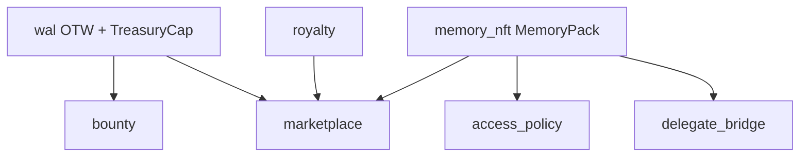

# OpenSpec — Sui Move contracts (`memwalpp_contracts`)

**Change ID:** `phase3-move-contracts`  
**Status:** Implemented (mainnet v1 published)  
**Package:** `packages/sui-contracts`  
**ADRs:** ADR-003 (mainnet), ADR-004 (metadata), ADR-005 (outcomes), ADR-006 (namespace), ADR-008 (bounty), ADR-011 (delegate)

---

## 1. Package identity

| Field | Value |
|-------|--------|
| **Move name** | `memwalpp_contracts` |
| **Published (mainnet)** | `0x48db008a3c9e638dd17d20702632d9909c3c075e44eb339f890fb29503ec3050` |
| **Toolchain** | Sui 1.70.2, edition 2024 |
| **Manifest** | [`packages/sui-contracts/deploy-manifest.json`](../../packages/sui-contracts/deploy-manifest.json) |
| **Deploy guide** | [`docs/deploy.md`](../deploy.md) |

---

## 2. Module structure

```
packages/sui-contracts/
├── Move.toml
├── Published.toml          # on-chain publish metadata (committed)
├── deploy-manifest.json    # judge-facing object IDs + modules
├── sources/
│   ├── wal.move            # OTW WAL coin (demo economics)
│   ├── memory_nft.move     # MemoryPack NFT
│   ├── royalty.move        # fee / royalty math (bps)
│   ├── marketplace.move    # list / buy / cancel (WAL escrow via DOF)
│   ├── bounty.move         # WAL bounty escrow + Walrus fulfillment ref
│   ├── delegate_bridge.move# rotate memwal_delegate on pack
│   └── access_policy.move  # Seal gate event (delegate-only)
└── tests/
    └── memwalpp_tests.move
```

### Dependency graph (logical)



---

## 3. Core types

### `memory_nft::MemoryPack` (owned object)

| Field | Type | Notes |
|-------|------|-------|
| `namespace` | `String` | Single namespace per pack (ADR-006) |
| `blob_ids` | `vector<ID>` | Walrus blob object refs |
| `pack_type` | `u8` | App-defined pack kind |
| `creator` | `address` | Royalty recipient |
| `poa_proofs` | `vector<vector<u8>>` | Off-chain PoA digests |
| `performance_score` | `u8` | UI hint only (ADR-005 pairs with events) |
| `is_listed` | `bool` | Listing flag |
| `royalty_bps` | `u16` | Max 1000 (10%) at mint |
| `memwal_delegate` | `address` | MemWal signing delegate slot |

### `marketplace::Marketplace` (shared object, `init`)

| Field | Role |
|-------|------|
| `prices` | `Table<ID, u64>` — list price in WAL mist |
| `sellers` | `Table<ID, address>` |
| DOF on `id` | Escrows `MemoryPack` while listed |

### `bounty::Bounty` (shared object per post)

| Field | Role |
|-------|------|
| `wal_escrow` | `Balance<WAL>` — **escrow** |
| `deadline_ms` | Expiry |
| `description_hash` | Off-chain bounty text commitment |
| `fulfillment_blob_id` | Walrus proof ref (`Option<ID>`) |
| `claimer` | Submitter address |
| `completed` | Terminal flag |

---

## 4. Events (indexer / dashboard)

| Event | Module | When |
|-------|--------|------|
| `PackMinted` | `memory_nft` | `mint_pack` |
| `PackListed` | `marketplace` | `list_pack` |
| `PackSold` | `marketplace` | `buy_pack` |
| `BountyPosted` | `bounty` | `post_bounty` |
| `FulfillmentSubmitted` | `bounty` | `submit_fulfillment` |
| `BountyPaid` | `bounty` | `approve_fulfillment` |
| `BountyCancelled` | `bounty` | `cancel_and_refund` |
| `DelegateRotated` | `delegate_bridge` | `rotate_memwal_delegate` |
| `SealAccessGranted` | `access_policy` | `seal_approve_for_blob` |

Schema alignment: [`indexer-schema.sql`](indexer-schema.sql).

---

## 5. Entry functions

### `memory_nft`

| Function | Visibility | Description |
|----------|------------|-------------|
| `mint_pack` | public | Mint pack; returns `MemoryPack` |
| `burn_pack` | public | Destroy pack |
| `share_to_sender` | public | Transfer pack to sender |

### `marketplace`

| Function | Description |
|----------|-------------|
| `list_pack` | Escrow pack + set price |
| `cancel_listing` | Seller withdraws listing |
| `buy_pack` | Pay WAL; fee + royalty split; return pack |

### `bounty` (escrow)

| Function | Actor | Description |
|----------|-------|-------------|
| `post_bounty` | Poster | Lock `Coin<WAL>` in shared `Bounty` |
| `submit_fulfillment` | Hunter | Attach `walrus_blob_id` |
| `approve_fulfillment` | Poster | Pay escrow to claimer |
| `cancel_and_refund` | Poster | After deadline, no fulfillment → refund |

### `delegate_bridge` / `access_policy`

| Function | Description |
|----------|-------------|
| `rotate_memwal_delegate` | Update delegate on owned pack |
| `seal_approve_for_blob` | Emit gate event if sender == delegate |

### `royalty` (pure math)

| Constant | Value |
|----------|-------|
| `MARKETPLACE_FEE_BPS` | 250 (2.5%) |

---

## 6. Escrow flows

### Marketplace listing

1. Seller calls `list_pack(market, pack, price)` → pack in DOF, WAL price in tables.  
2. Buyer `buy_pack` → splits WAL: marketplace fee + royalty → creator; remainder → seller.  
3. Buyer receives `MemoryPack`.

### Bounty (ADR-008)

1. `post_bounty` — WAL → `Balance` inside shared `Bounty`.  
2. `submit_fulfillment(walrus_blob_id)` — links Walrus proof.  
3. `approve_fulfillment` — poster pays claimer.  
4. Or `cancel_and_refund` after deadline if no submission.

---

## 7. TypeScript integration

| Artifact | Location |
|----------|----------|
| Package ID + object IDs | `@memwalpp/shared` → `deployed-package.ts` |
| CLI info script | `pnpm contracts:info` → `scripts/move-package-info.ts` |
| PTB composition | `apps/dashboard` (dApp Kit) — future |

**Rule:** Apps import constants from `shared`; never hardcode package ID in multiple places.

---

## 8. Verification

```bash
cd packages/sui-contracts
sui move build
sui move test    # 1 test: mint_and_rotate_delegate
```

Root: `pnpm contracts:build` · `pnpm contracts:test`

---

## 9. Acceptance

| Check | PASS |
|-------|------|
| OpenSpec (this doc) | ✓ |
| Sources + tests in repo | ✓ |
| `Published.toml` + `deploy-manifest.json` | ✓ |
| `docs/deploy.md` | ✓ |
| TS package constants + `contracts:info` | ✓ |
| README / SUBMISSION / ARCHITECTURE updated | ✓ |
