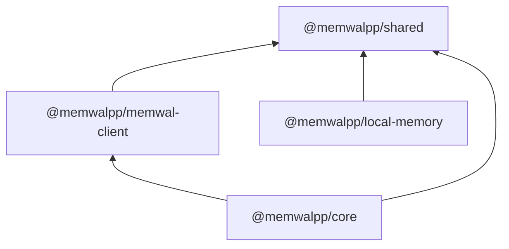

# Phase 1 — Import dependency graph (DAG)

**Source of truth:** [ADR-013 — Monorepo boundaries](../decisions/ADR-013.md)  
**Companion OpenSpecs:** [`openspec-package-shared.md`](openspec-package-shared.md), [`openspec-package-core.md`](openspec-package-core.md), [`openspec-package-local-memory.md`](openspec-package-local-memory.md)

---

## 1. Allowed edges (compile-time / `package.json`)

Edges read **left depends on right** (`A → B` means A imports or lists B as dependency).

```
@memwalpp/shared          (no workspace deps)

@memwalpp/memwal-client  →  @memwalpp/shared

@memwalpp/local-memory   →  @memwalpp/shared

@memwalpp/core           →  @memwalpp/shared
                         →  @memwalpp/memwal-client
```

### Mermaid (same graph)



---

## 2. Verification (repo state)

| Package | `package.json` `dependencies` | Status |
|---------|------------------------------|--------|
| `shared` | _(none workspace)_ | OK |
| `memwal-client` | `shared` | OK |
| `local-memory` | `shared`, **`better-sqlite3`** (npm native) | OK |
| `core` | `memwal-client`, `shared` | OK |

**Cycle check:** No package in `{shared, memwal-client, local-memory, core}` appears both upstream and downstream of itself on any path — **acyclic**.

---

## 3. Forbidden edges (do not introduce)

| From | To | Why |
|------|-----|-----|
| `shared` | any `@memwalpp/*` | Foundation leaf |
| `memwal-client` | `core`, `local-memory` | I/O boundary stays thin |
| `local-memory` | `core`, `memwal-client` | Leaf scorer / future DB; no orchestration upward |
| `core` | `local-memory` | **Deferred** until a concrete use-case needs it; then only **core → local-memory**, never reverse |

Apps (`apps/*`) may depend on any combination of the four; **packages must not import `apps/*`**.

---

## 4. Recommended implementation order

1. **`shared`** — extend types (`MemorySpace`, etc.) + validators; keeps all downstream green.
2. **`memwal-client`** + **`local-memory`** in **parallel** (both only need `shared`).
3. **`core`** — add orchestration that composes `memwal-client` + `shared` first; add `local-memory` only when a function truly needs local scoring inside core (prefer keeping local calls in apps until then).

---

## 5. Optional Phase 1b edge

If product requires “core runs local scorer before building outcome”:

- Add **`core` → `local-memory`** only; update this doc and ADR-013 appendix in the same PR.

---

## 6. Related (outside Phase 1 packages)

`apps/dashboard`, `apps/agent-swarm`, `apps/cli` → may depend on `shared`, `core`, `memwal-client`, `local-memory`, `ui` per feature — not part of the foundation DAG above.
